# NSX-T 2.2 Installation

## Overview

The following installation guide follows the implementation of a functional NSX-T 2.2 Installation configured for PKS 1.2 in a vSphere nested lab environment. This implementation uses variables that function in the lab environment. Anyone is welcome to build a similar lab environment and follow along with the lab exercises, but please note you will need to replace any variables such as IP addresses and FQDNs and replace them with the appropriate values for your lab environment.

The steps provided in this lab guide are intended for a lab implementation and do not necessarily align with best practices for production implementiations. While the instructions provided in this lab guide did work for the author in their lab environment, VMware and/or any contributors to this Guide provide no assurance, warranty or support for any content provided in this guide.

## Installation Notes

Anyone who implements any software used in this lab must provide their own licensing and ensure that their use of all software is in accordance with the software's licensing. This guide provides no access to any software licenses.

For those needing access to VMware licensing for lab and educational purposes, we recommend contacting your VMware account team. Also, the [VMware User Group's VMUG Advantage Program](https://www.vmug.com/Join/VMUG-Advantage-Membership) provides a low-cost method of gaining access to VMware licenses for evaluation purposes.

### NSX-T

This lab follows the standard documentation, which includes additional details and explanations: [NSX-T 2.2 Installation Guide](https://docs.vmware.com/en/VMware-NSX-T/2.2/com.vmware.nsxt.install.doc/GUID-3E0C4CEC-D593-4395-84C4-150CD6285963.html)

#### Install NSX-T Manager

NOTE: NSX Manager OVA cannot be installed via HTML5 client, so for installation labs please use the vSphere web client (Flash-based).

This section follows the standard documentation, which includes additional details and explanations: [NSX Manager Installation](https://docs.vmware.com/en/VMware-NSX-T/2.2/com.vmware.nsxt.install.doc/GUID-A65FE3DD-C4F1-47EC-B952-DEDF1A3DD0CF.html)

1.0 Install NSX-T Manager OVA File using OVF Install Wizard

<details><summary>Screenshot 1.1</summary>
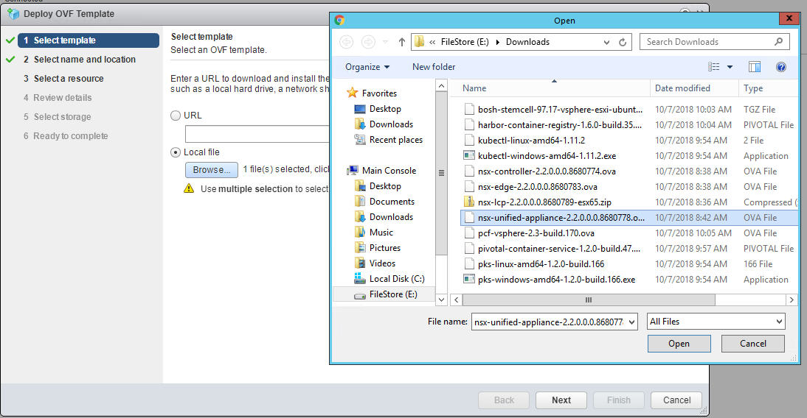
</details>

<details><summary>Screenshot 1.2</summary>

</details>

<details><summary>Screenshot 1.3</summary>

</details>

<details><summary>Screenshot 1.4</summary>

</details>

<details><summary>Screenshot 1.5</summary>

</details>

<details><summary>Screenshot 1.6</summary>
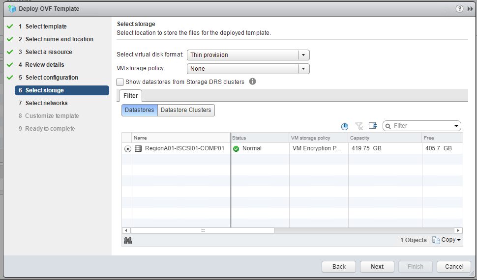
</details>

<details><summary>Screenshot 1.7</summary>
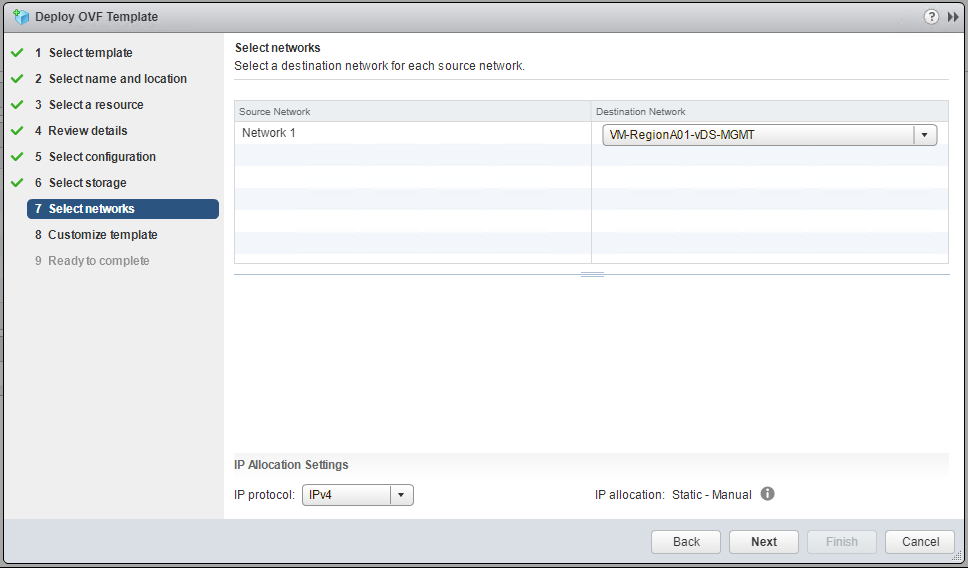
</details>
<br/>
1.8 On the Customize Template tab, enter the following variables:

- System Root User Password: VMware1!
- CLI Admin User Password: VMware1!
- CLI Audit User Password: VMware1!
- Hostname: nsx-manager
- Rolename: nsx-manager
- Default Gateway: 192.168.100.1
- Management Network IPv4 Address: 192.168.100.110
- Management Network Netmask: 255.255.255.0
- DNS Server List: 192.168.110.10
- Domain Search List: corp.local
- NTP Server: 192.168.100.1
- Enable SSH: True
- Allow Root SSH Logins: True
- All other options were left as default values

<details><summary>Screenshot 1.8</summary>
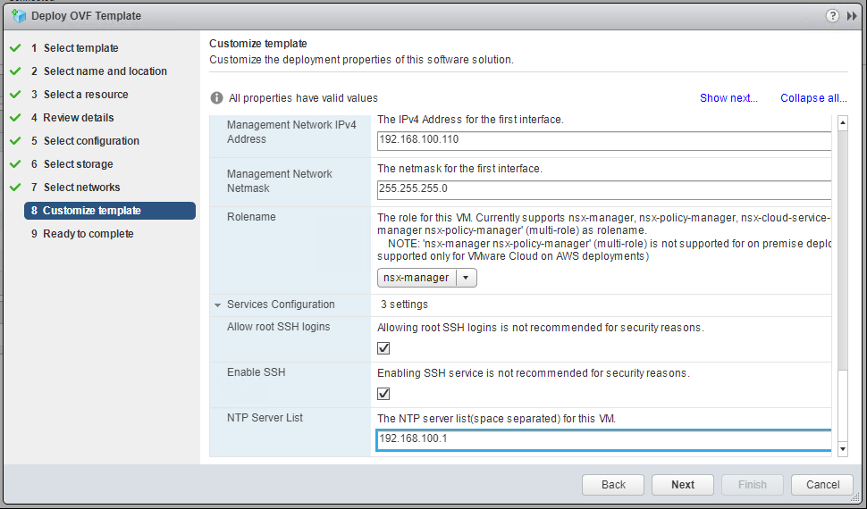
</details>

<br/>
1.9 Complete the Deploy OVF Template Wizard
<br/>
<br/>

<details><summary>Screenshot 1.9</summary>
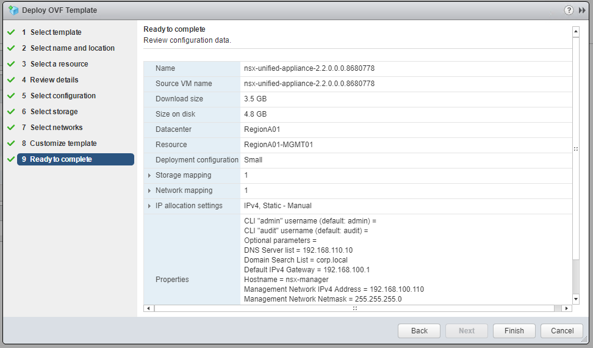
</details>

<br/>
1.10 In the vSphere web client go to the task console and verify that the Status for Deploy OVF Template is "Completed" before proceeding
<br/>
<br/>

<details><summary>Screenshot 1.10</summary>
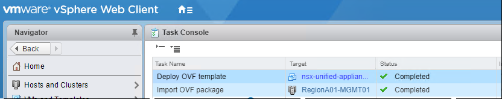
</details>

<br/>
1.11 In the vSphere web client power on the NSX-Manager VM
<br/>
NOTE: If the option to power on the NSX-Manager VM is not available, log out and then log back in to the vSphere web client
<br/>
<br/>

<details><summary>Screenshot 1.11</summary>
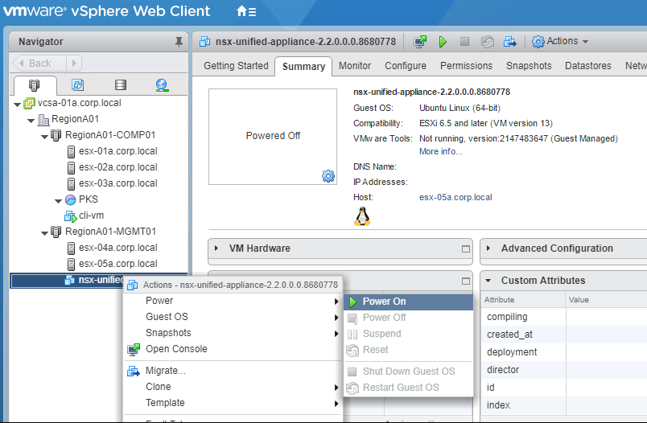
</details>

<br/>
1.12 Using the IP address you assigned to NSX Manager in the Deploy OVF Template Wizard, open a web browser connection to NSX Manager, for example:

```https://192.168.100.110/login.jsp```

<br/>
NOTE: On your first login, you will be prompted to accept the EULA
<br/>
<br/>

<details><summary>Screenshot 1.12</summary>
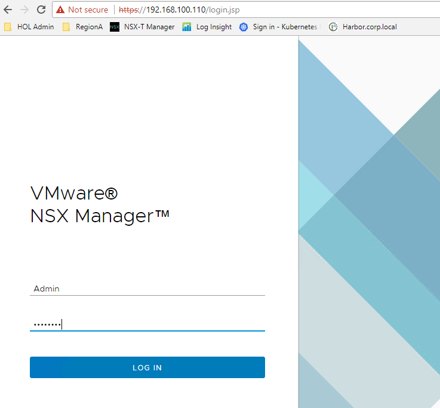
</details>
<br/>
This completes the NSX Manager installation, please proceed on to the Controller installation section below

#### NSX-T Controller Installation

This section follows the standard documentation, which includes additional details and explanations: [Configure Automated Installation of Controller and Cluster using the NSX Manager UI](https://docs.vmware.com/en/VMware-NSX-T/2.2/com.vmware.nsxt.install.doc/GUID-92843E38-127B-4F85-8B7A-C8027E86175C.html)

As this is a lab environment, we will only be installing a single controller, you can reference the documentation above for instructions on multi-controller installations

2.0 Install NSX-T Controller
<br/>
<br/>
2.1 In the NSX Manager web interface, go to the Compute Managers section in the fabric panel per the image below

<details><summary>Screenshot 2.1</summary>
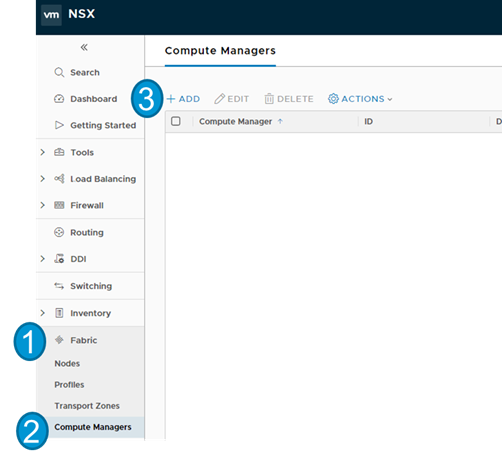
</details>
<br/>

2.2 In the New Compute Manager dialogue box, enter the following variables:

- Name: vcsa-01a.corp.local
- Domain Name: vcsa-01a.corp.local
- Username: administrator@corp.local
- Password: VMware1!
- Leave the SHA-256 Thumbprint Blank

<details><summary>Screenshot 2.2</summary>

</details>
<br/>

2.3 In the Invalid Thumbprint dialogue box, click add to populate vCenters thumbprint

<details><summary>Screenshot 2.3</summary>
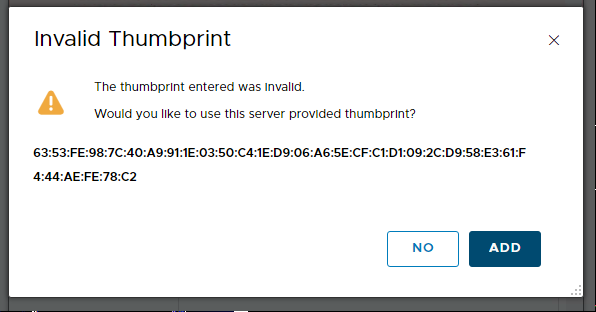
</details>
<br/>

2.4 On the Compute Managers Screen, verify that the registration status for vcsa-01a.corp.local is "Registered". If it is showing up as not registered, please see section 2.5 below.

<details><summary>Screenshot 2.4</summary>
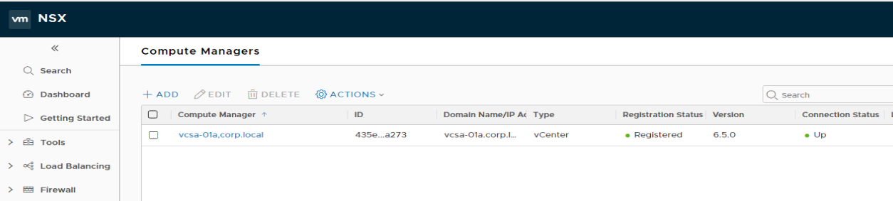
</details>
<br/>

<details><summary>2.5 If your computer manager registration status is "Not Registered" expand this section and follow the steps</summary>
<br/>
2.5.1 In the NSX Manager UI on the "Compute Managers" page, click on the "Not Registered" link as shown in the following image:

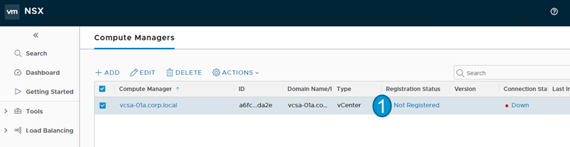
<br/>
<br/>
2.5.2 Select the checkbox next to the error shown, and click "Resolve" as in the image below:
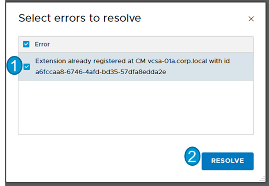
<br/>
<br/>
2.5.3 In the Resolve Errors dialogue box, enter the administrator username and password for vCenter and click "Add" as in the image below - Note that it can take a minute or two for the Registration Status to update:

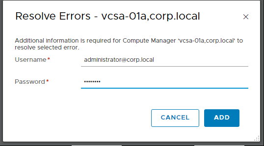
</details>
<br/>

2.6 In the NSX Manager web UI, expand the System panel, select the "Components" page, and select "Add Controllers"

<details><summary>Screenshot 2.6</summary>
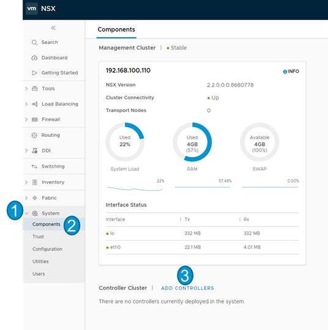
</details>
<br/>

2.7 In the Add Controllers dialogue box on the Common Attributes page, enter the following values and click "Next":

- Compute Manager: vcsa-01a.corp.local
- Enable SSH: True
- Enable Root Access: True
- Join Existing Cluster: False
- Shared Secret: VMware1!
- CLI Password: VMware1!
- Root Password: VMware1!
- All other variables left to default values

<details><summary>Screenshot 2.7</summary>
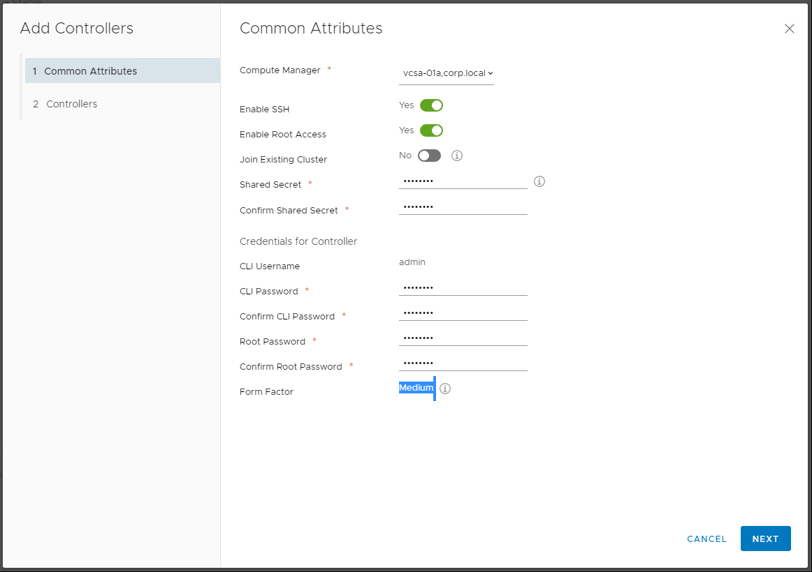
</details>
<br/>

2.7 In the Add Controllers dialogue box on the Controllers page, enter the following values and click "Finish"

- Hostname: nsx-controller
- Cluster: RegionA01-MGMT01
- Resource Pool: Null
- Host: Null
- Datastore: RegionA01-ISCSI01-COMP01
- VM-RegionA01-vDS-MGMT
- Management IP/Netmask: 192.168.100.111/24
- Management Gateway: 192.168.100.1

<details><summary>Screenshot 2.7</summary>
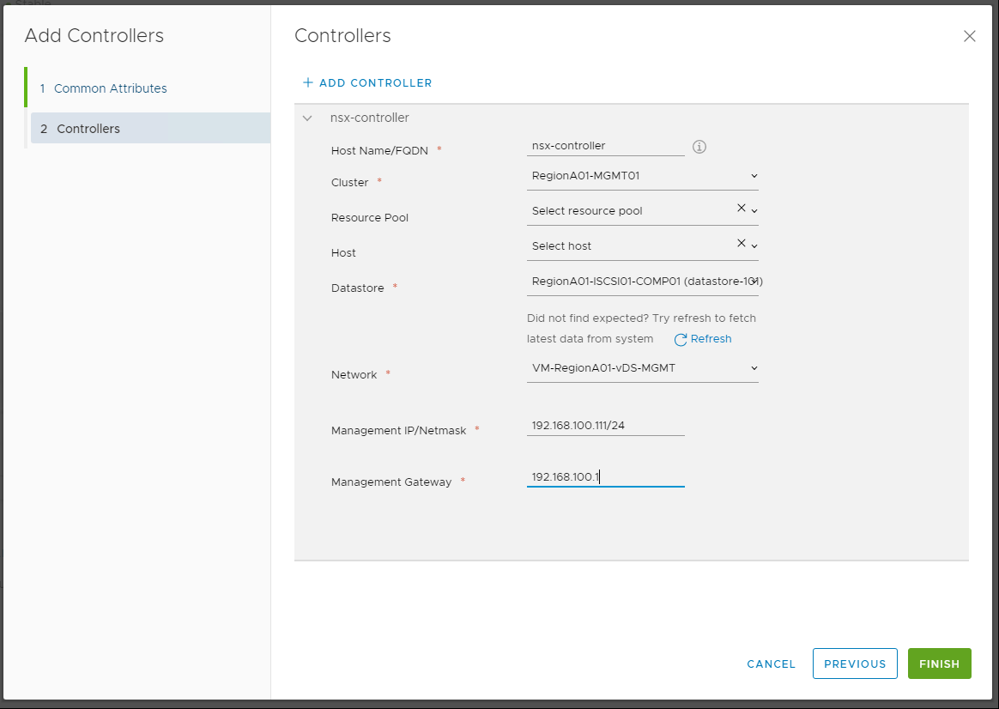
</details>
<br/>

2.8 View the controller deployment status near the bottom of the Components page and wait for the controller to finish deploying. If your controller deployment has a power-on error, please see section 2.8 below. 

<details><summary>Screenshot 2.8</summary>
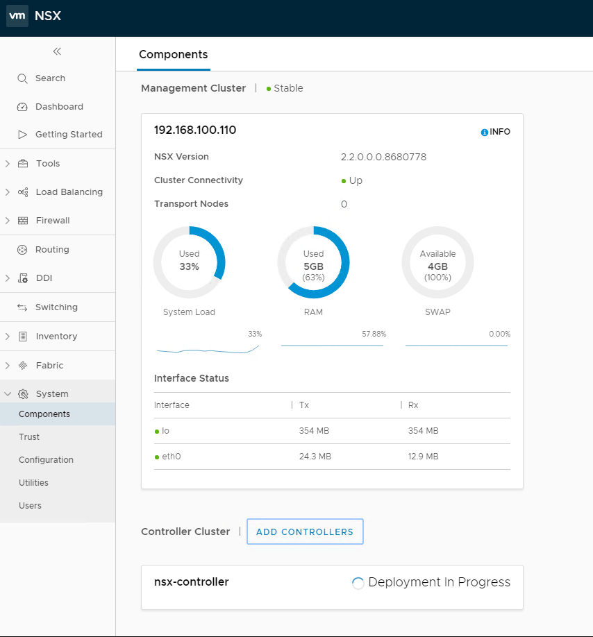
</details>
<br/>

<details><summary>2.9 If you have a power-on error for your controller VM, expand this section and follow the steps</summary>
<br/>
2.9.1 The standard PKS lab environment does not have enough RAM in the management cluster to meet the default requirement of the NSX-T 2.2 Controller. If you are using your own lab environment, you can adjust the RAM available in your manamgent cluster if you have capacity. Otherwise we will adjust the RAM used by the NSX controller VM

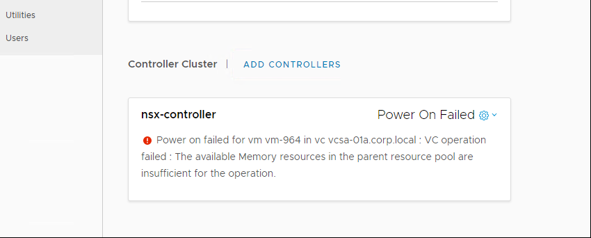
<br/>
2.9.2 In the vSphere web or HTML5 client, select the nsx-controller VM and Edit Settings

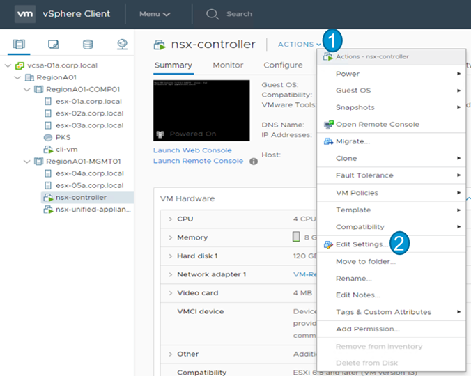
<br/>
2.9.3 Change the Memory to 8GB and press OK

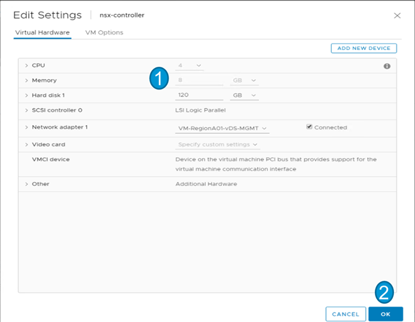
<br/>
2.9.4 Power on the nsx-controller VM in vSphere web or HTML5 Client

</details>
<br/>
2.10 Wait for the controller cluster to appear on the Components page in NSX Manager web UI
<details><summary>Screenshot 2.10</summary>
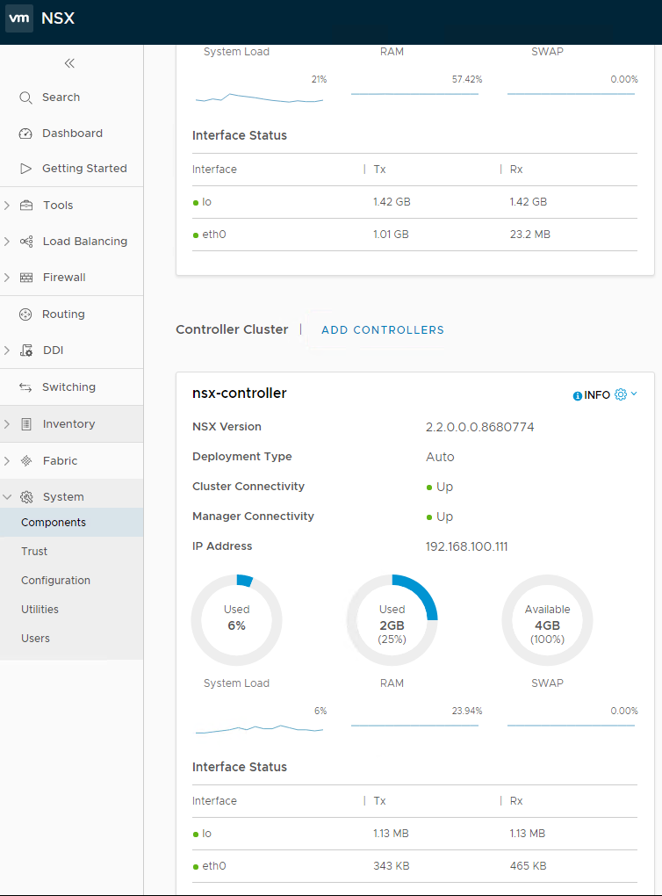
</details>
<br/>
2.11 Open an SSH session to nsx-manager and nsx-controller and confirm controller registration per Screenshot 2.11 below

<details><summary>Screenshot 2.11</summary>
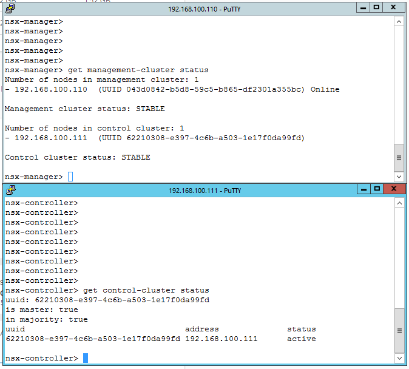
</details>

#### NSX-T Edge Installation

This section follows the standard documentation, which includes additional details and explanations: [Configure Automated Installation of Controller and Cluster using the NSX Manager UI](https://docs.vmware.com/en/VMware-NSX-T/2.2/com.vmware.nsxt.install.doc/GUID-92843E38-127B-4F85-8B7A-C8027E86175C.html)

<details><summary>Screenshot</summary>

</details>

<details><summary>Screenshot</summary>

</details>

<details><summary>Screenshot</summary>

</details>

<details><summary>Screenshot</summary>

</details>

<details><summary>Screenshot</summary>

</details>

<details><summary>Screenshot</summary>

</details>


<details><summary>Screenshot</summary>

</details>