# NSX-T 2.2 Configuration for PKS

## Overview

Lab 2 Continues on from Lab 1 with the configuration of NSX-T for PKS. 

The steps provided in this lab guide are intended for a lab implementation and do not necessarily align with best practices for production implementiations. While the instructions provided in this lab guide did work for the author in their lab environment, VMware and/or any contributors to this Guide provide no assurance, warranty or support for any content provided in this guide.

## Installation Notes

Anyone who implements any software used in this lab must provide their own licensing and ensure that their use of all software is in accordance with the software's licensing. This guide provides no access to any software licenses.

For those needing access to VMware licensing for lab and educational purposes, we recommend contacting your VMware account team. Also, the [VMware User Group's VMUG Advantage Program](https://www.vmug.com/Join/VMUG-Advantage-Membership) provides a low-cost method of gaining access to VMware licenses for evaluation purposes.

### Configure NSX-T for PKS

This section follows the PKS Documentation, which includes additional details and explanations -  [Step 3: Create the NSX-T Opbjects Required for PKS](https://docs.pivotal.io/runtimes/pks/1-2/nsxt-prepare-env.html#create-objects)

1.0 Create NSX Network Objects

1.1 Create IP Pools for Tunnel Endpoint IP Addresses and NSX Load Balancer Virtual IP addresses

1.1.1 In the NSX Manager UI, go to Inventory > Groups > IP Pools and click "Add"

Screenshot 1.1.1

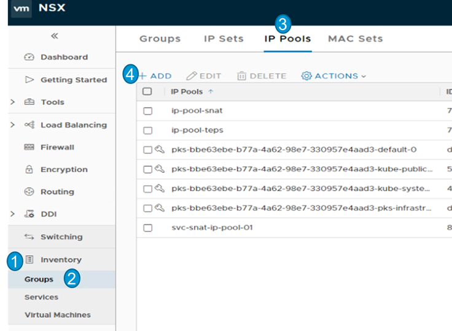

 

1.1.2 Create an IP pool for tunnel endpoints with the following details:

- Name: ip-pool-teps
- Click "Add" to add a subnet
  - IP Range 192.168.130.51 - 192.168.130.75
  - Gateway: 192.168.130.1
  - CIDR: 192.168.130.0/24
  - DNS Servers: 192.168.110.10
  - DNS Suffix: corp.local

Screenshot 1.1.2

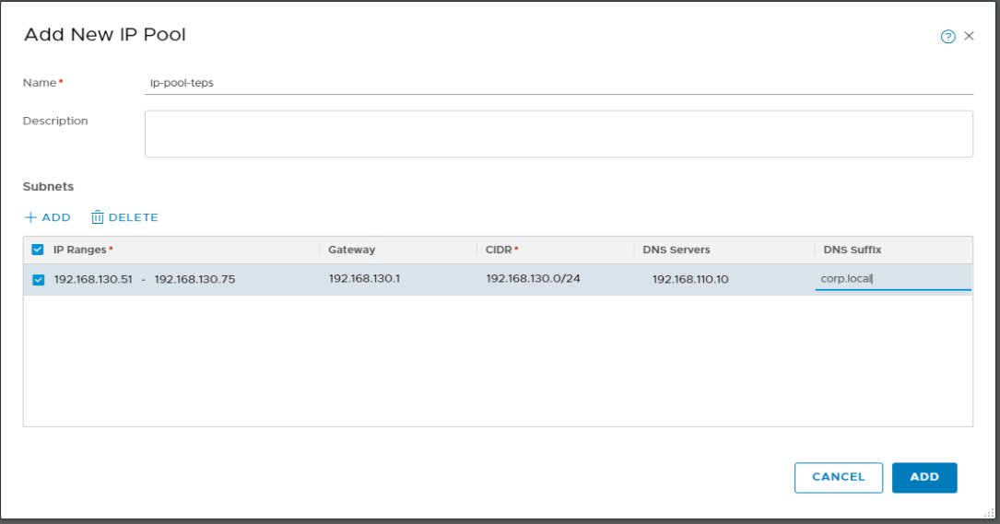

 

1.1.3 Create an IP pool for NSX Load Balancer VIPs with the following details:

- Name: ip-pool-vips
- Click "Add" to add a subnet
  - IP Range 10.40.14.34 -  10.40.14.62
  - CIDR: 10.40.14.32/27

Screenshot 1.1.3

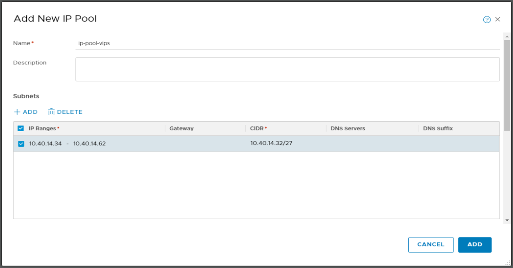

 

1.2 Add transport zones for overlay and VLAN networks

1.2.1 In the NSX Manager UI, go to Fabric > Transport Zones and click "Add"

Screenshot 1.2.1

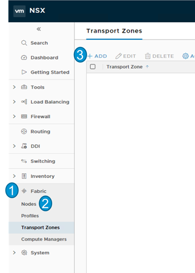

 

1.2.2 Add an overlay transport zone with the following details:

- Name: tz-verlay
- N-VDS Name: hs-overlay
- N-VDS Mode: Standard
- Traffic Type: Overlay

Screenshot 1.2.2

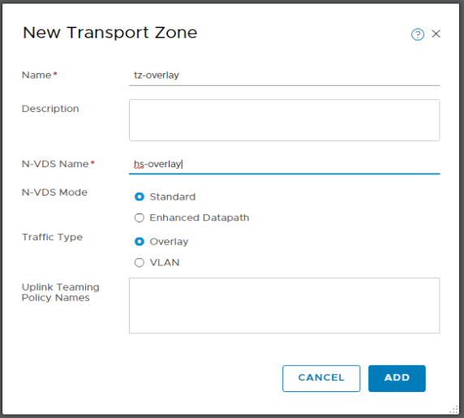

 

1.2.3 Add an vlan transport zone with the following details:

- Name: tz-vlan
- N-VDS Name: hs-vlan
- N-VDS Mode: Standard
- Traffic Type: VLAN

Screenshot 1.2.3

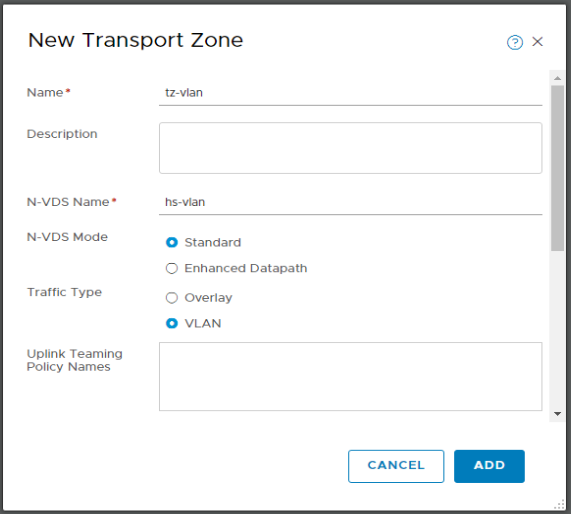

1.3 NSX-T manager installation provides 2 default uplink profiles, one for overlays and one for vlans. In this lab and in other general use cases, the default uplink profiles work fine so you can skip section 1.3, or you can follow through step 1.3 to view and validate the uplink profiles and adjust if needed for your environment

 If you would like to review or update the default uplink profiles, expand this section, otherwise proceed to step 1.4

1.3.1 In the NSX Manager UI, go to Fabric > Profiles > Uplink Profiles

Screenshot 1.3.1

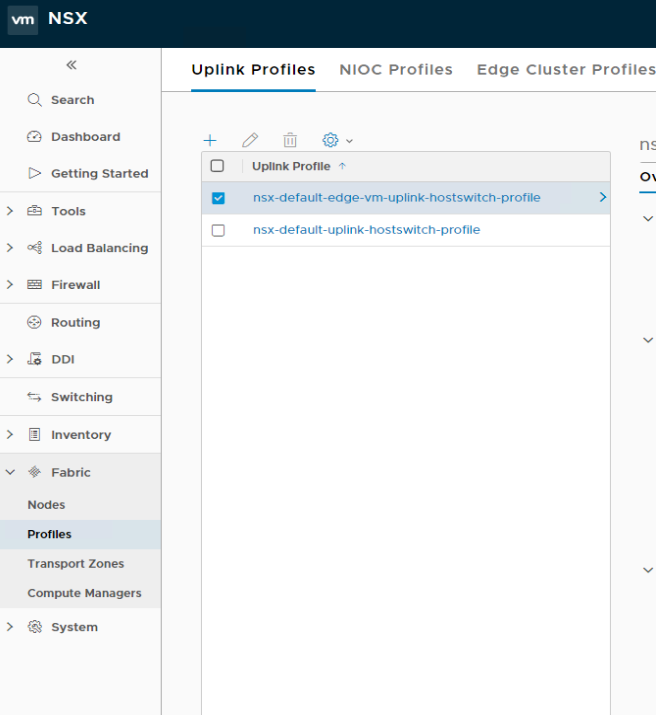

 

1.3.2 Observe the configuration of the profile and adjust as needed

Screenshot 1.3.2

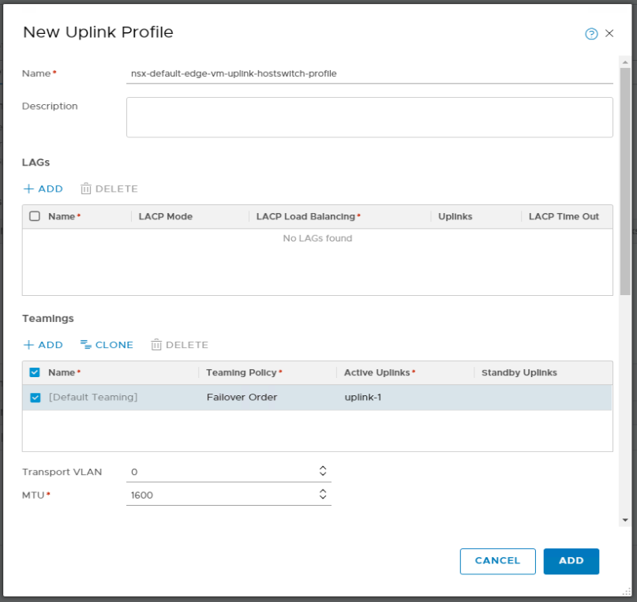

 

1.3.3 Observe the configuration of the profile and adjust as needed

Screenshot 1.3.3

 

1.4 Configure each esxi host in your vCenter environment that may need connect to an NSX-T Overlay or VLAN network and your NSX Edge vm as Transport Nodes using the following procedure.

For the lab environment used in this example, configure all esxi hosts and your NSX Edge VM as transport nodes

1.4.1 In the NSX Manager UI, go to Fabric > Nodes > Transport Zones and click "ADD"

Screenshot 1.4.1

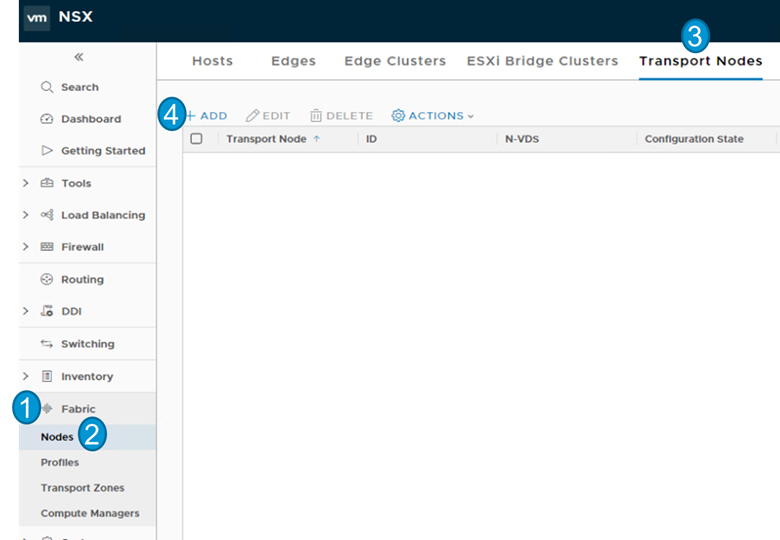

 

1.4.2 Complete the Add Transport Node for each relevant esxi host and NSX Edge vm. The esxi hosts should be added to the tz-overlay transport zone, and the NSX Edge VM should be added to both the tz-overlay and tz-vlan transport zones.

After you fill in the variables in the General tab of the Add Transport Node wizard, click "ADD". You do not need to make any edits to the N-VDS tab of the Add Transport Zone wizard

1.4.2.1 Add Transport Node for esxi hosts with the following details:

- Name: esx-01a
  - Update the name for each esxi host you add
- Node: esx-01a.corp.local
  - Update the Node for each esxi host you add
- Transport Zones: tz-overlay
  - Select tz-overlay from available transport zones and click the arrow to move tz-overlay to the "Selected" section
- Click on the N-VDS
- N-VDS Name: hs-overlay
- NIOC Profile: nsx-default-nioc-hostswitch-profile
- Uplink Profile: nsx-default-uplink-hostswitch-profile
- IP Assignment: Use IP Pool
- IP Pool: ip-pool-teps
- Physical NICS:
  - Column 1: vmnic1
  - Column 2: uplink-1

Screenshot 1.4.2.1.1

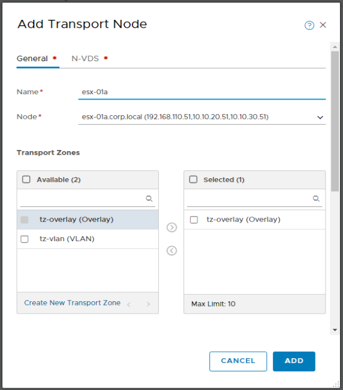

Screenshot 1.4.2.1.2

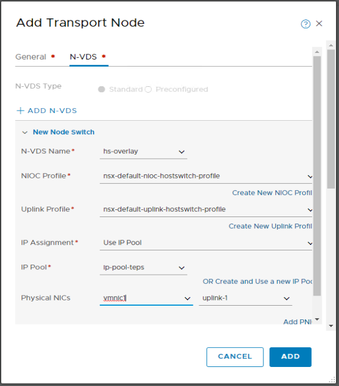

Screenshot 1.4.2.1.3

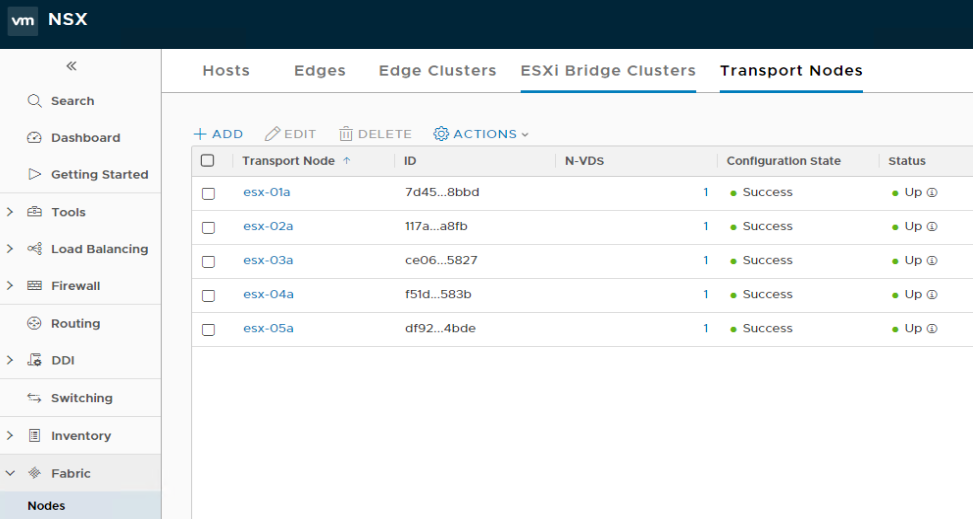

 

1.4.2.2 Add Transport Node for NSX Edge VM with the following details:

- Name: nsx-edge
- Node: nsx-edge
- Transport Zones: tz-overlay & tz-vlan
  - Select tz-overlay & tz-vlan from available transport zones and click the arrow to move them to the "Selected" section
- Click on the N-VDS - you will add a node switch for both transport zones
- N-VDS Name: hs-overlay
- Uplink Profile: nsx-default-edge-vm-uplink-profile
- IP Assignment: Use IP Pool
- IP Pool: ip-pool-teps
- Physical NICS:
  - Column 1: fp-eth0
  - Column 2: uplink-1
- Click "ADD N-VDS" to add an additional VDS definition for the tz-vlan transport zone
- N-VDS Name: hs-vlan
- Uplink Profile: nsx-default-edge-vm-uplink-profile
- Physical NICS:
  - Column 1: fp-eth1
  - Column 2: uplink-1

 Note that once added, it can take up to a few minutes before the transport node status changes to "Up"

Screenshot 1.4.2.2.1

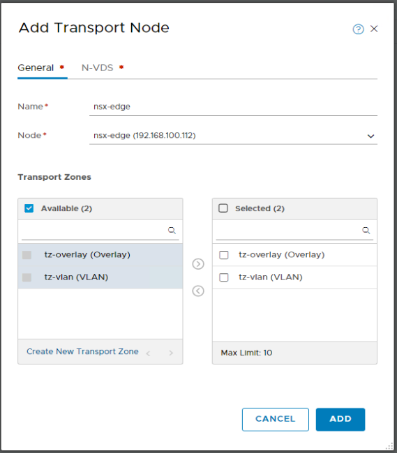

Screenshot 1.4.2.2.2

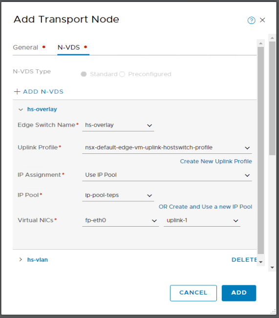

Screenshot 1.4.2.2.3

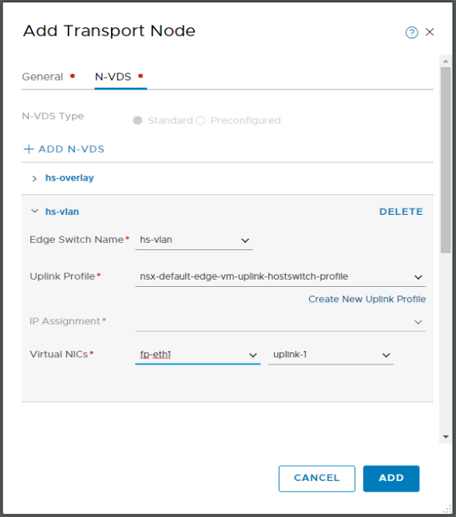

Screenshot 1.4.2.2.4

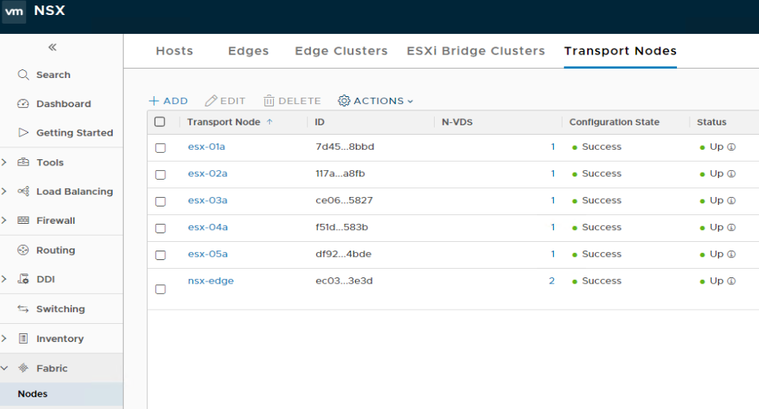

 

1.5 Create NSX IP Blocks for node and pod networks

1.5.1 In the NSX Manager UI, in the navigation bar select DDI > IPAM and click "Add"

Screenshot 1.5.1

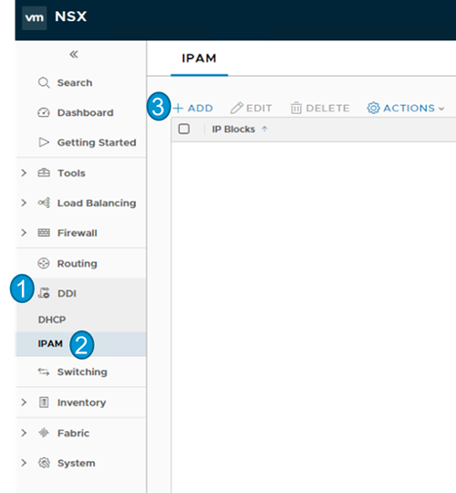

 

1.5.2 Add the following 3 IP Blocks

- Block1
  - Name: ip-block-pks-nodes-snat
  - CIDR: 172.15.0.0/16
- Block2
  - Name: ip-block-pks-pods-NO-snat
  - 172.100.0.0/16
- Block3
  - Name: ip-block-pks-pods-snat
  - CIDR: 172.16.0.0/16

Screenshot 1.5.2

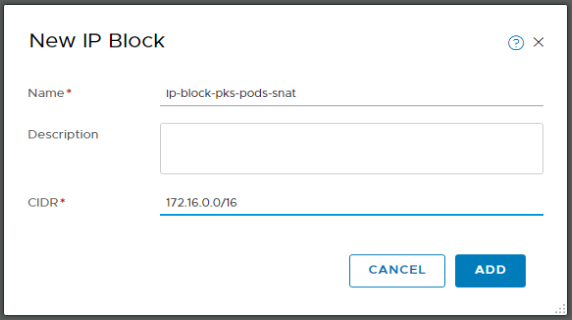

Screenshot

Screenshot

Screenshot

Screenshot

Screenshot

Screenshot

Screenshot

Screenshot

