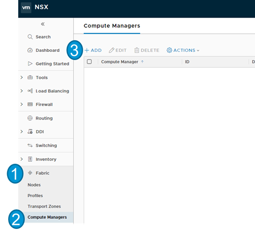
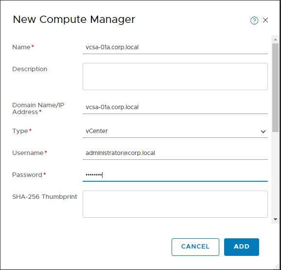

# PKS 1.2 NSXT 2.2 Installation Guide

## Overview

The following installation guide follows the implementation of a functional NSX-T 2.2 and PKS 1.2 Installation in a vSphere nested lab environment. This implementation uses variables that function in the lab environment. Anyone is welcome to build a similar lab environment and follow along with the lab exercises, but please note you will need to replace any variables such as IP addresses and FQDNs and replace them with the appropriate values for your lab environment. 

It is possible to build an identical lab environment that can use identical variables to those used in this lab guide. It is our intent to provide a tutorial for building an identical lab environment but it is unclear when that will be completed. In the meantime anyone seeking to build a functionally identical lab can load a live lab environment on VMware Hands on labs to identify any installation variables needed to build a comperable nested lab: [HOL-1931-01-CNA - VMware Pivotal Container Service and Kubernetes](https://www.vmwarelearningplatform.com/HOL/catalogs/catalog/874)

VMware employees who have access to the OneCloud Environment can load a vApp template to provide a pre-built lab environment and follow along with the steps in this guide. For details on accessing the vApp, please check the CNA TPM Wiki on Confluence.

The steps provided in this lab guide are intended for a lab implementation and do not necessarily align with best practices for production implementiations. While the instructions provided in this lab guide did work for the author in their lab environment, VMware and/or any contributors to this Guide provide no assurance, warranty or support for any content provided in this guide.

## Installation Notes

Anyone who implements any software used in this lab must provide their own licensing and ensure that their use of all software is in accordance with the software's licensing. This lab provides no access to any licenses needed to implement a comperable environment to the lab used to develop this guide.

For those needing access to VMware licensing for lab and educational purposes, we recommend contacting your VMware account team. Also, the [VMware User Group's VMUG Advantage Program](https://www.vmug.com/Join/VMUG-Advantage-Membership) provides a low-cost method of gaining access to VMware licenses for evaluation purposes.

### NSX-T

This lab follows the standard documentation, which includes additional details and explanations: [NSX-T 2.2 Installation Guide](https://docs.vmware.com/en/VMware-NSX-T/2.2/com.vmware.nsxt.install.doc/GUID-3E0C4CEC-D593-4395-84C4-150CD6285963.html)

#### Install NSX-T Manager

NOTE: NSX Manager OVA cannot be installed via HTML5 client, so for installation labs please use the vSphere web client (Flash-based).

This section follows the standard documentation, which includes additional details and explanations: [NSX Manager Installation](https://docs.vmware.com/en/VMware-NSX-T/2.2/com.vmware.nsxt.install.doc/GUID-A65FE3DD-C4F1-47EC-B952-DEDF1A3DD0CF.html)

1.0 Install NSX-T Manager OVA File using OVF Install Wizard

<details><summary>Screenshot 1.1</summary>

</details>

<details><summary>Screenshot 1.2</summary>

</details>

<details><summary>Screenshot 1.3</summary>

</details>

<details><summary>Screenshot 1.4</summary>

</details>

<details><summary>Screenshot 1.5</summary>

</details>

<details><summary>Screenshot 1.6</summary>

</details>

<details><summary>Screenshot 1.7</summary>

</details>
<br/>
1.8 On the Customize Template tab, enter the following variables:

- System Root User Password: VMware1!
- CLI Admin User Password: VMware1!
- CLI Audit User Password: VMware1!
- Hostname: nsx-manager
- Rolename: nsx-manager
- Default Gateway: 192.168.100.1
- Management Network IPv4 Address: 192.168.100.110
- Management Network Netmask: 255.255.255.0
- DNS Server List: 192.168.110.10
- Domain Search List: corp.local
- NTP Server: 192.168.100.1
- Enable SSH: True
- Allow Root SSH Logins: True
- All other options were left as default values

<details><summary>Screenshot 1.8</summary>

</details>

<br/>
1.9 Complete the Deploy OVF Template Wizard
<br/>
<br/>

<details><summary>Screenshot 1.9</summary>

</details>

<br/>
1.10 In the vSphere web client go to the task console and verify that the Status for Deploy OVF Template is "Completed" before proceeding
<br/>
<br/>

<details><summary>Screenshot 1.10</summary>

</details>

<br/>
1.11 In the vSphere web client power on the NSX-Manager VM
<br/>
NOTE: If the option to power on the NSX-Manager VM is not available, log out and then log back in to the vSphere web client
<br/>
<br/>

<details><summary>Screenshot 1.11</summary>

</details>

<br/>
1.12 Using the IP address you assigned to NSX Manager in the Deploy OVF Template Wizard, open a web browser connection to NSX Manager, for example:

```https://192.168.100.110/login.jsp```

<br/>
NOTE: On your first login, you will be prompted to accept the EULA
<br/>
<br/>

<details><summary>Screenshot 1.12</summary>

</details>
<br/>
This completes the NSX Manager installation, please proceed on to the Controller installation section below

#### NSX-T Controller Installation

This section follows the standard documentation, which includes additional details and explanations: [Configure Automated Installation of Controller and Cluster using the NSX Manager UI](https://docs.vmware.com/en/VMware-NSX-T/2.2/com.vmware.nsxt.install.doc/GUID-92843E38-127B-4F85-8B7A-C8027E86175C.html)

As this is a lab environment, we will only be installing a single controller, you can reference the documentation above for instructions on multi-controller installations

2.0 Install NSX-T Controller
<br/>
<br/>
2.1 In the NSX Manager web interface, go to the Compute Managers section in the fabric panel per the image below

<details><summary>Screenshot 2.1</summary>

</details>
<br/>

2.2 In the New Compute Manager dialogue box, enter the following variables:

- Name: vcsa-01a.corp.local
- Domain Name: vcsa-01a.corp.local
- Username: administrator@corp.local
- Password: VMware1!
- Leave the SHA-256 Thumbprint Blank

<details><summary>Screenshot 2.2</summary>

</details>

<details><summary>Screenshot</summary>

</details>

<details><summary>Screenshot</summary>

</details>


<details><summary>Screenshot</summary>

</details>