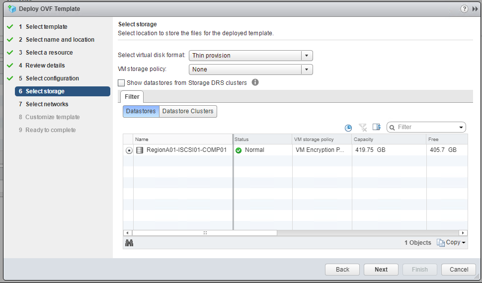
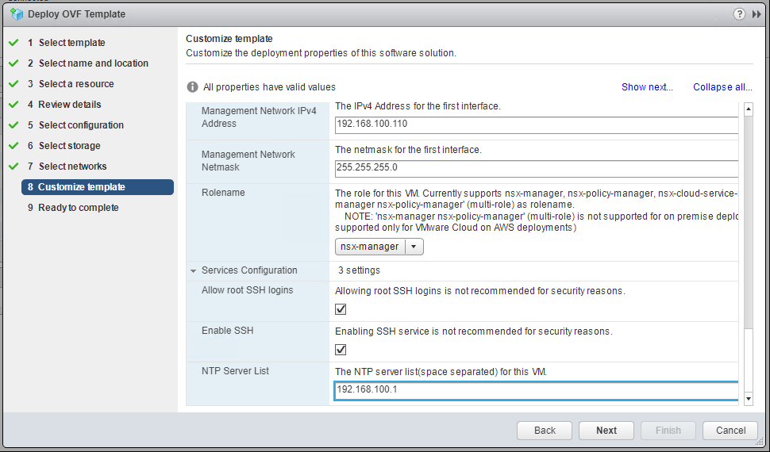
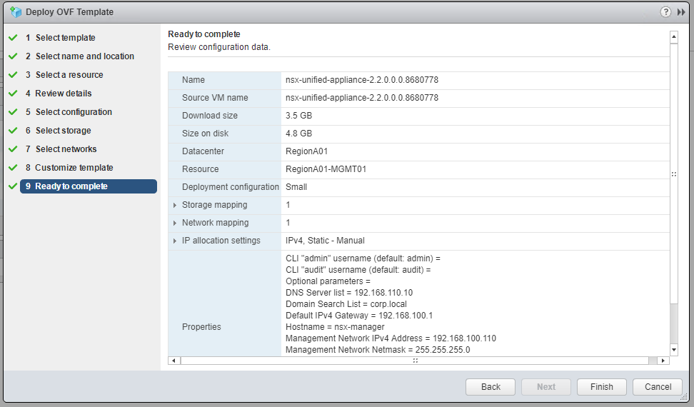

# PKS 1.2 NSXT 2.2 Installation Guide

## Overview

The following are rough notes and screenshots for my installation of PKS 1.1 with NSX-T 2.2.

This is built on the standard HOL PKS Base Lab Topology

## Installation Notes

### NSX-T

This lab follows the standard documentation, which includes additional details and explanations: [NSX-T 2.2 Installation Guide](https://docs.vmware.com/en/VMware-NSX-T/2.2/com.vmware.nsxt.install.doc/GUID-3E0C4CEC-D593-4395-84C4-150CD6285963.html)

#### Install NSX-T Manager

NOTE: NSX Manager OVF cannot be installed via HTML5 client so for installation labs please use the Flash vSphere web client.

This section follows the standard documentation, which includes additional details and explanations: [NSX Manager Installation](https://docs.vmware.com/en/VMware-NSX-T/2.2/com.vmware.nsxt.install.doc/GUID-A65FE3DD-C4F1-47EC-B952-DEDF1A3DD0CF.html)

1.0 Install NSX-T Manager OVA File using OVF Install Wizard

<details><summary>Screenshot 1.1</summary>

</details>

<details><summary>Screenshot 1.2</summary>

</details>

<details><summary>Screenshot 1.3</summary>

</details>

<details><summary>Screenshot 1.4</summary>

</details>

<details><summary>Screenshot 1.5</summary>

</details>

<details><summary>Screenshot 1.6</summary>

</details>

<details><summary>Screenshot 1.7</summary>

</details>
<br/>
1.8 On the Customize Template tab, enter the following variables:

- System Root User Password: VMware1!
- CLI Admin User Password: VMware1!
- CLI Audit User Password: VMware1!
- Hostname: nsx-manager
- Rolename: nsx-manager
- Default Gateway: 192.168.100.1
- Management Network IPv4 Address: 192.168.100.110
- Management Network Netmask: 255.255.255.0
- DNS Server List: 192.168.110.10
- Domain Search List: corp.local
- NTP Server: 192.168.100.1
- Enable SSH: True
- Allow Root SSH Logins: True
- All other options were left as default values

<details><summary>Screenshot 1.8</summary>

</details>

<br/>
1.9 Complete the Deploy OVF Template Wizard
<br/>
<br/>

<details><summary>Screenshot 1.9</summary>

</details>

<br/>
1.10 In the vSphere web client go to the task console and verify that the Status for Deploy OVF Template is "Completed" before proceeding
<br/>
<br/>

<details><summary>Screenshot 1.10</summary>

</details>

<br/>
1.11 In the vSphere web client power on the NSX-Manager VM
<br/>
NOTE: If the option to power on the NSX-Manager VM is not available, log out and then log back in to the vSphere web client
<br/>
<br/>

<details><summary>Screenshot 1.11</summary>

</details>

<br/>
1.12 Using the IP address you assigned to NSX Manager in the Deploy OVF Template Wizard, open a web browser connection to NSX Manager, for example:

```https://192.168.100.110/login.jsp```

<br/>
NOTE: On your first login, you will be prompted to accept the EULA
<br/>
<br/>

<details><summary>Screenshot 1.12</summary>

</details>
<br/>
This completes the NSX Manager installation, please proceed on to the Controller installation section below

#### NSX-T Controller Installation

This section follows the standard documentation, which includes additional details and explanations: [NSX Manager Installation](https://docs.vmware.com/en/VMware-NSX-T/2.2/com.vmware.nsxt.install.doc/GUID-A65FE3DD-C4F1-47EC-B952-DEDF1A3DD0CF.html)

As this is a lab environment, we will only be installing a single controller, you can reference the documentation above for instructions on multi-controller installations

2.0 Install NSX-T Controller


<details><summary>Screenshot</summary>

</details>

<details><summary>Screenshot</summary>

</details>

<details><summary>Screenshot</summary>

</details>

<details><summary>Screenshot</summary>

</details>


<details><summary>Screenshot</summary>

</details>