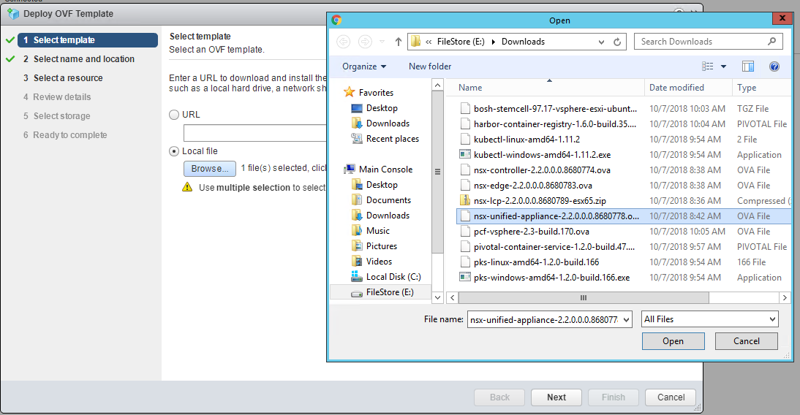

# PKS 1.2 NSXT 2.2 Installation Notes

## Overview

The following are rough notes and screenshots for my installation of PKS 1.1 with NSX-T 2.2

## Installation Notes

### NSX-T

#### NSX-T Manager

NOTE: NSX Manager OVF cannot be installed via HTML5 client so for installation labs we will be using vSphere web client 

1. Install NSX-T Manager OVA File using OVF Install Wizard

Screenshot 1.1

Screenshot 1.2

Screenshot 1.3

Screenshot 1.4

Screenshot 1.5

Screenshot 1.6

Screenshot 1.7

 
1.8 On the Customize Template tab, enter the following variables:

- System Root User Password: VMware1!
- CLI Admin User Password: VMware1!
- CLI Audit User Password: VMware1!
- Hostname: nsx-manager
- 

Screenshot

Screenshot

Screenshot

Screenshot

Screenshot

Screenshot

Screenshot

Screenshot

Screenshot

Screenshot

