# NSX-T 2.3 Installation

## Overview

The following installation guide follows the implementation of a functional NSX-T 2.3 Installation configured for PKS 1.2 in a vSphere nested lab environment. This implementation uses variables that function in the lab environment. Anyone is welcome to build a similar lab environment and follow along with the lab exercises, but please note you will need to replace any variables such as IP addresses and FQDNs and replace them with the appropriate values for your lab environment.

The steps provided in this lab guide are intended for a lab implementation and do not necessarily align with best practices for production implementiations. While the instructions provided in this lab guide did work for the author in their lab environment, VMware and/or any contributors to this Guide provide no assurance, warranty or support for any content provided in this guide.

## Installation Notes

Anyone who implements any software used in this lab must provide their own licensing and ensure that their use of all software is in accordance with the software's licensing. This guide provides no access to any software licenses.

For those needing access to VMware licensing for lab and educational purposes, we recommend contacting your VMware account team. Also, the [VMware User Group's VMUG Advantage Program](https://www.vmug.com/Join/VMUG-Advantage-Membership) provides a low-cost method of gaining access to VMware licenses for evaluation purposes.

### NSX-T

This lab follows the standard documentation, which includes additional details and explanations: [NSX-T 2.3 Installation Guide](https://docs.vmware.com/en/VMware-NSX-T/2.2/com.vmware.nsxt.install.doc/GUID-3E0C4CEC-D593-4395-84C4-150CD6285963.html)

#### Install NSX-T Manager

Overview of Tasks Covered in Lab 1

- Step1: Deploy NSX Manager (= NSX Unified Appliance)
- Step 2: Deploy NSX Controllers
- Step 3: Create NSX Cluster (Management Plane and Cluster Control Plane)
- Step 4: Deploy NSX Edges
- Step 5: Register NSX Edge with NSX Manager
- Step 6:  Enable repository service on NSX Manager
- Step 7: Create TEP IP Pool
- Step 8: Create Transport Zone Overlay (TZ-Overlay)
- Step 9: Create Transport Zone for VLAN (TZ-VLAN)
- Step 10: Create Uplink Profile for Edge Node
- Step 11: Create Edge Transport Node
- Step 12: Create Edge Cluster
- Step 13: Create T0 router

NOTE: NSX Manager OVA cannot be installed via HTML5 client, so for installation labs please use the vSphere web client (Flash-based).

This section follows the standard documentation, which includes additional details and explanations: [NSX Manager Installation](https://docs.vmware.com/en/VMware-NSX-T/2.2/com.vmware.nsxt.install.doc/GUID-A65FE3DD-C4F1-47EC-B952-DEDF1A3DD0CF.html)

### Step 1:  Deploy NSXT Manager using OVF Install Wizard

1.1 In the vSphere web client (not the HTML5 Client), From the Hosts and Clusters view, right click on the RegionA01-MGMT01 Cluster and select `Deploy OVF Template'

Screenshot 1.1

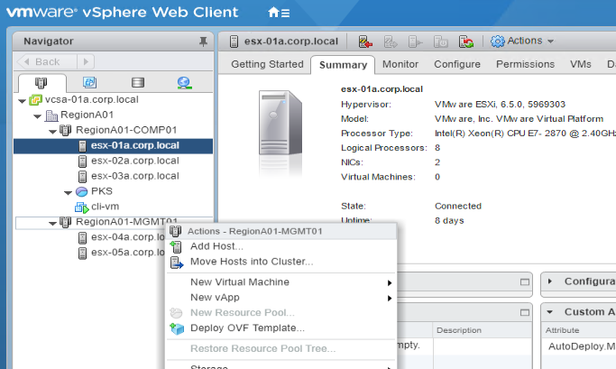

 

1.2 On the `Select Template` step, select `Local File` and Navigate to the NSXT Manager OVA file. In the reference lab, this is located on the E:/Downloads Directory

Screenshot 1.2

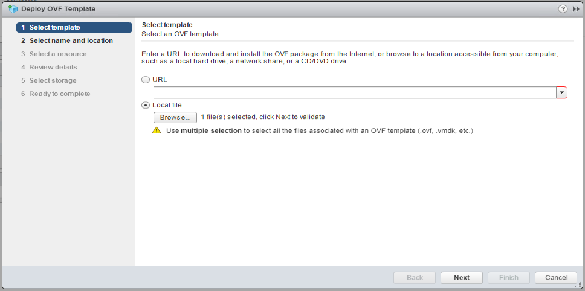

 

1.3 On the `Select name and location` step, use the name `nsxmgr-01a` and select RegionA01 Datacenter as the location

Screenshot 1.3

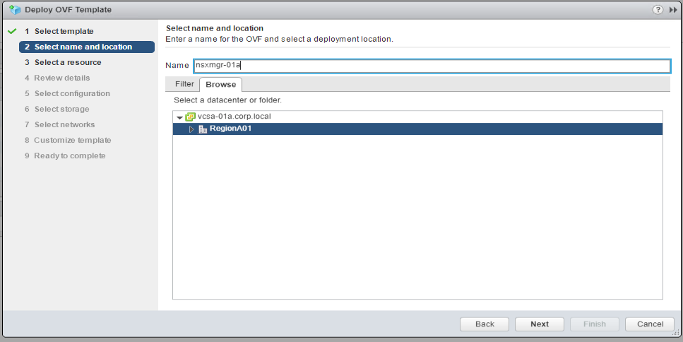

 

1.4 On the `Select a Resource` step, select RegionA01-MGMT

Screenshot 1.4

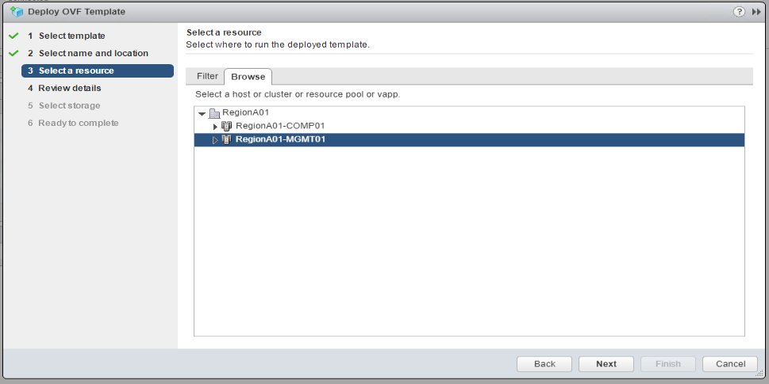

 

1.5 On the `Review Details` step, verify details and click `Next`

Screenshot 1.5

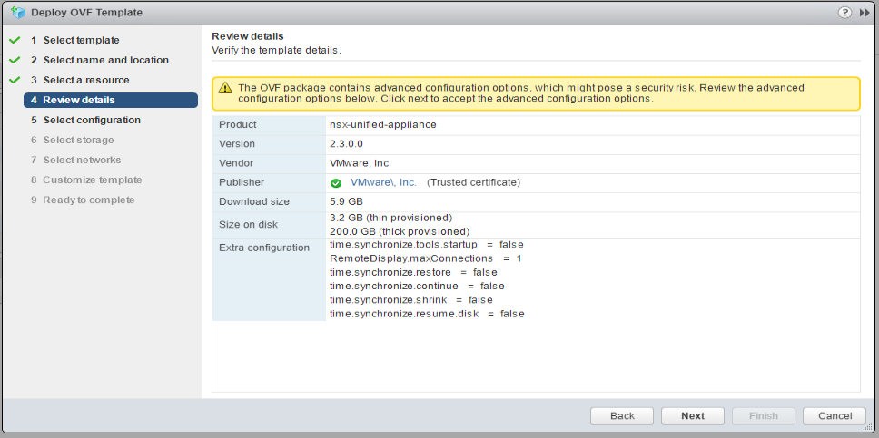

 

1.6 On the `Select Configuration` step, select a Small Configuration

Screenshot 1.6

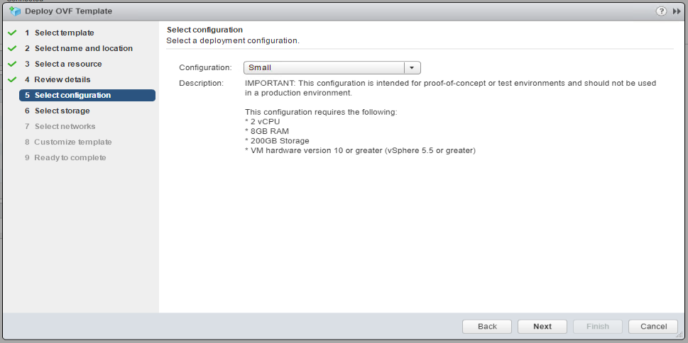

 

1.7 On the `Select Storage` step, set the virtual disk format to `Thin Provision` and select the `RegionA01-ISCSI01-COMP01` datastore

Screenshot 1.7

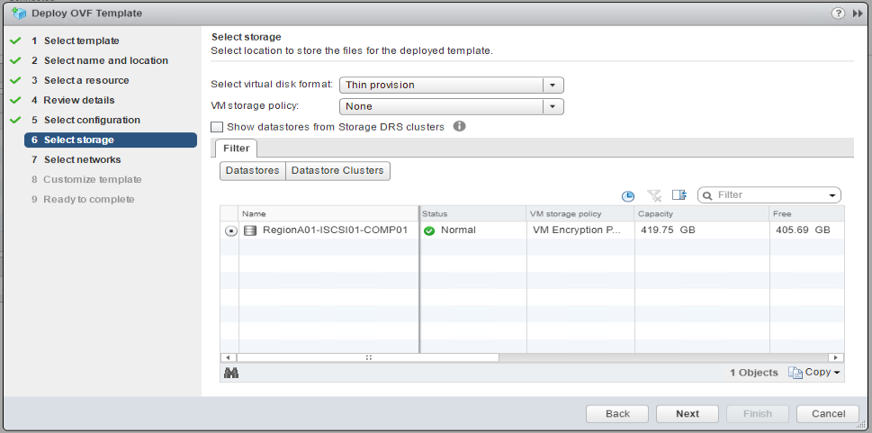

 

1.8 On the `Select Networks` step, set the Destination Network to `VM-RegionA01-vDS-MGMT

Screenshot 1.8

 

1.9 On the `Customize Template` step, enter the following variables:

- System Root User Password: VMware1!
- CLI Admin User Password: VMware1!
- CLI Audit User Password: VMware1!
- Hostname: nsxmgr-01a
- Rolename: nsx-manager
- Default Gateway: 192.168.110.1
- Management Network IPv4 Address: 192.168.110.42
- Management Network Netmask: 255.255.255.0
- DNS Server List: 192.168.110.10
- Domain Search List: corp.local
- NTP Server: 192.168.100.1
- Enable SSH: True
- Allow Root SSH Logins: True
- All other options were left as default values

Screenshot 1.8

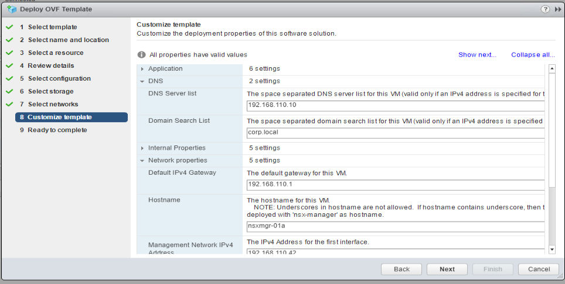

 

1.9 Complete the Deploy OVF Template Wizard

Screenshot 1.9

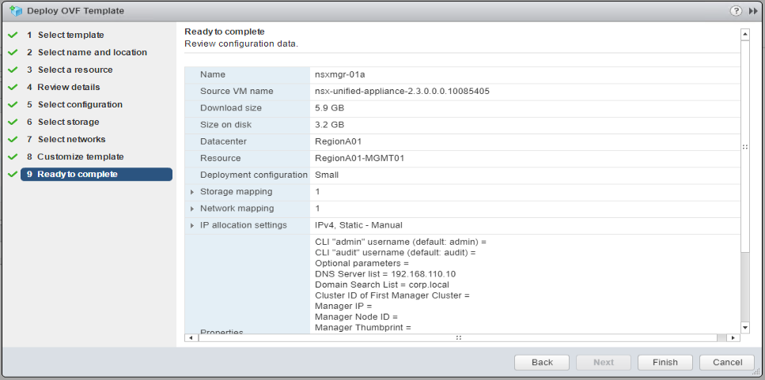

 

1.10 In the vSphere web client go to the task console and verify that the Status for Deploy OVF Template is "Completed" before proceeding
 

Screenshot 1.10

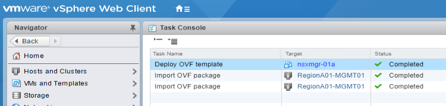

 

1.11 In the vSphere web client go to Hosts and Clusters and on the `Actions` menu for `nsxmgr-01a`, select `Edit Settings`

Screenshot 1.11

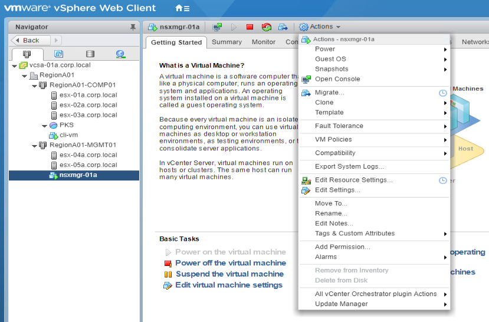

 

1.12 Expand the `Memory` section and set the `Reservation` to `0`

NOTE: This step is provided to help limit the requirements for resource constrained lab environments, if your lab environment has ample hardware resources, you may skip this step

Screenshot 1.12

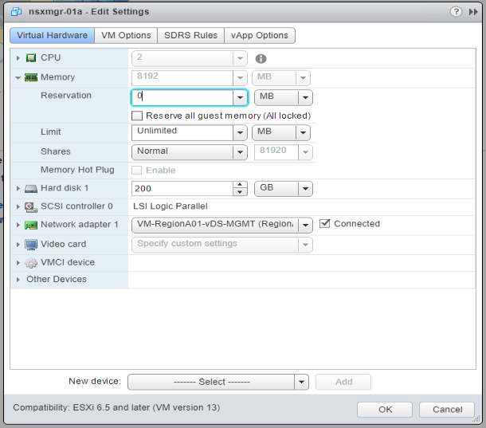

 

1.13 In the vSphere web client power on the nsxmgr-01a VM, wait a few minutes for NSX Manager to fully boot up before proceeding to the next step

NOTE: If the option to power on the nsxmgr-01a VM is not available, log out and then log back in to the vSphere web client

Screenshot 1.13

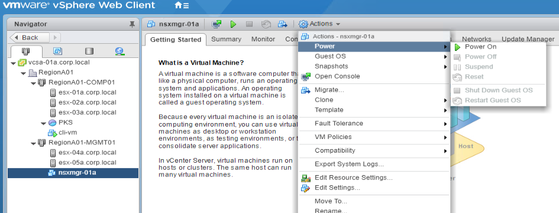

 

1.14 Using the IP address you assigned to NSX Manager in the Deploy OVF Template Wizard, open a web browser connection to NSX Manager, for example:

`https://nsxmgr-01a.corp.local/login.jsp`

 
NOTE: On your first login, you will be prompted to accept the EULA
 
 

Screenshot 1.14

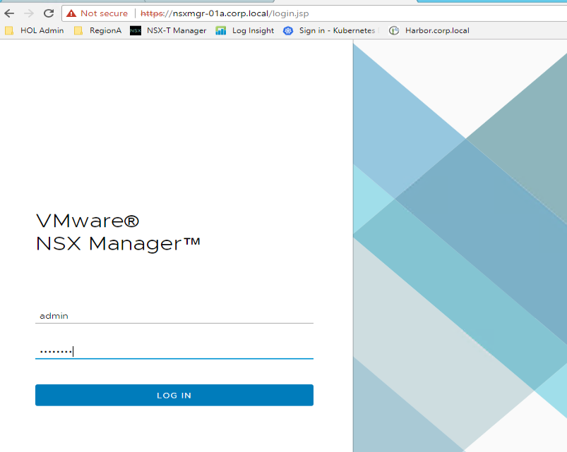

 
This completes the NSX Manager installation, please proceed on to the Controller installation section below

#### 2.0 NSX-T Controller Installation

2.1 In the vSphere web client (not the HTML5 Client), From the Hosts and Clusters view, right click on the RegionA01-MGMT01 Cluster and select `Deploy OVF Template'

Screenshot 2.1

 

2.2 On the `Select Template` step, select `Local File` and navigate to the NSX Controller OVA file

Screenshot 2.2

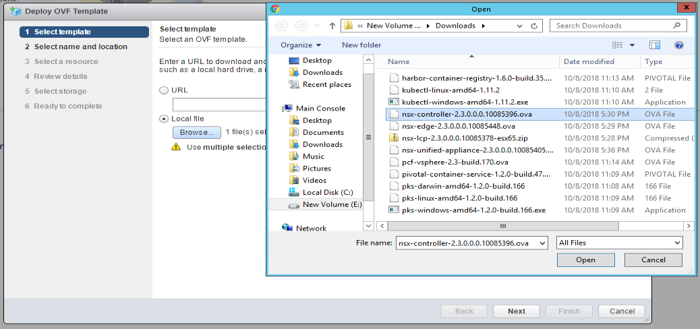

 

2.3 On the `Select name and location` step, enter `nsxc-01a` as the name and select `RegionA01` as the datacenter

Screenshot 2.3

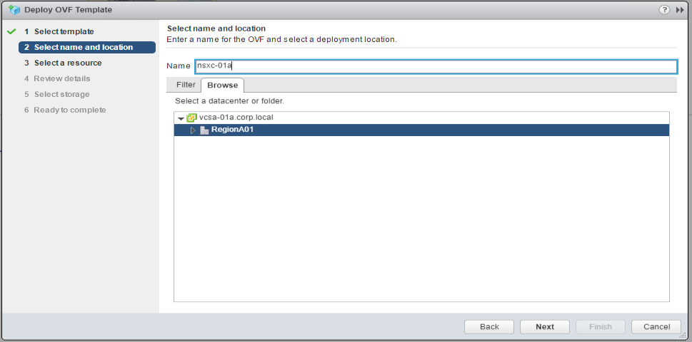

 

2.4 On the `Select a resource` step, select the `RegionA01-MGMT01` cluster

Screenshot 2.4

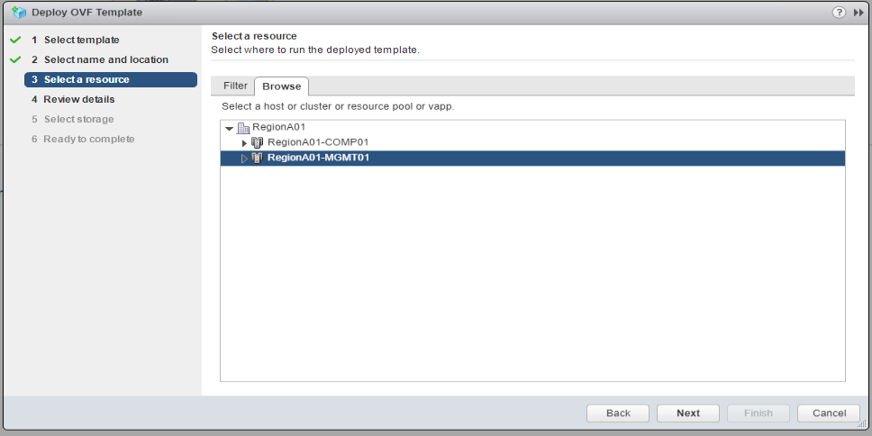

 

2.5 On the `Review details` step, review the details and click `Next`

Screenshot 2.5

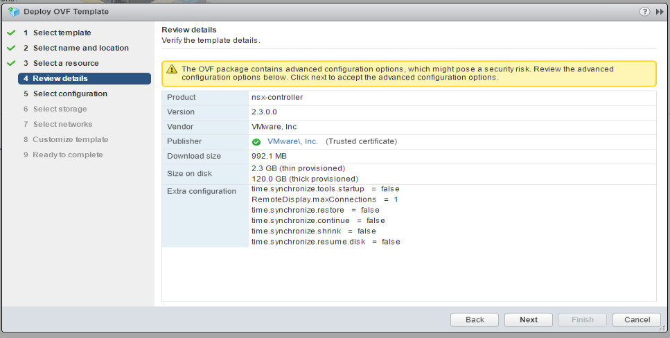

 

2.6 In the NSX Manager web UI, expand the System panel, select the "Components" page, and select "Add Controllers"

Screenshot 2.6

 

2.7 On the `Select Configuration` step, select a `Small` configuration

Screenshot 2.7

 

2.8 On the `Select Storage` step, select `Thin Provision` as the virtual disk format and `RegionA01-ISCSI01-COMP01` as the datastore

Screenshot 2.8

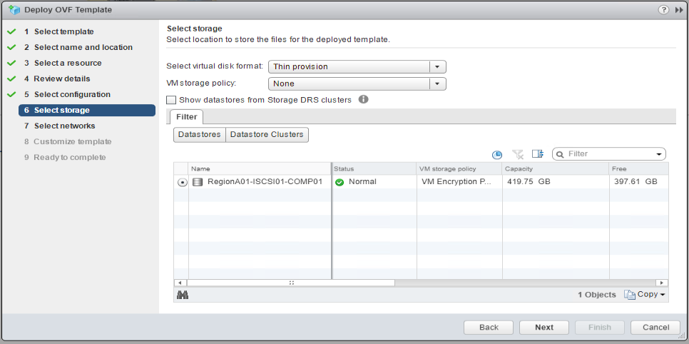

 

2.9 On the `Select networks` step, set the `Destination Network` to `VM-RegionA01-vDS-MGMT`

Screenshot 2.9

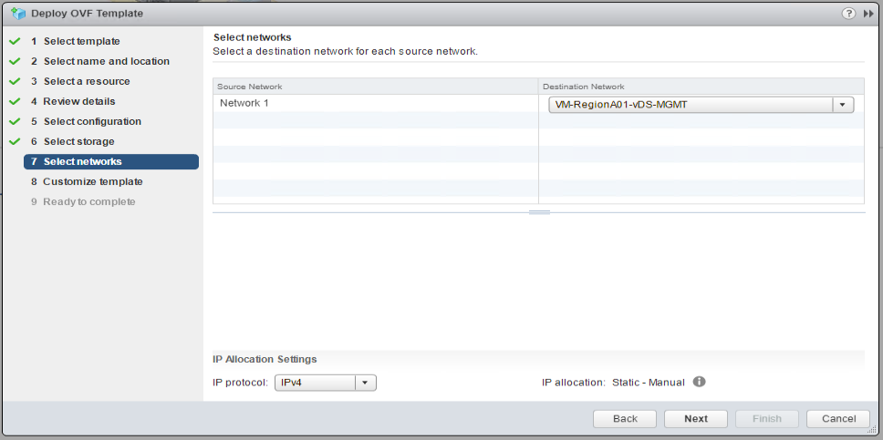

 

2.10 On the `Customize template` step, enter the following details:

- CLI Admin User Password: VMware1!
- CLI Audit User Password: VMware1!
- System Root User Password: VMware1!
- DNS Server List: 192.168.110.10
- Domain Search List: corp.local
- Default Gateway: 192.168.110.1
- Hostname: nsxc-01a
- Management IP: 192.168.110.31
- Management Netmask: 255.255.255.0
- Allow root SSH logins: True
- Enable SSH: True
- NTP Server List: 192.168.100.1
- Use defaults for any parameters that arent specified

Screenshot 2.10

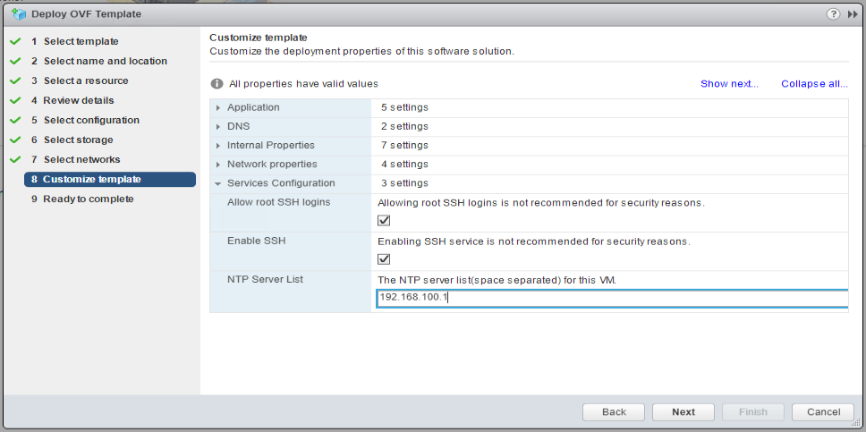

 

2.11 On the `Ready to complete` step, review details and click `Finish`. 

Screenshot 2.11

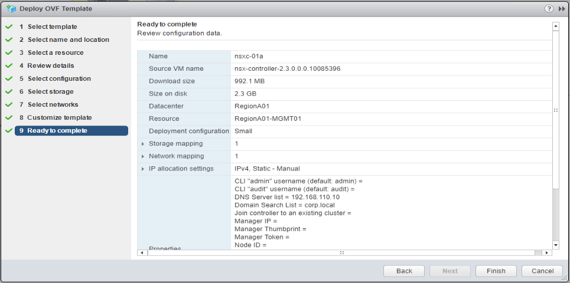

 

2.12 In the vSphere web client, monitor the OVF deployment on the `Tasks` or `Recent Tasks` screen and wait for the status of the `Deploy OVF template` task to change to `Completed` befor proceeding

Screenshot 2.12

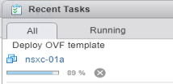

 

2.13 In the vSphere web client go to Hosts and Clusters and on the `Actions` menu for your NSX Controller VM and select `Edit Settings`

Screenshot 2.13

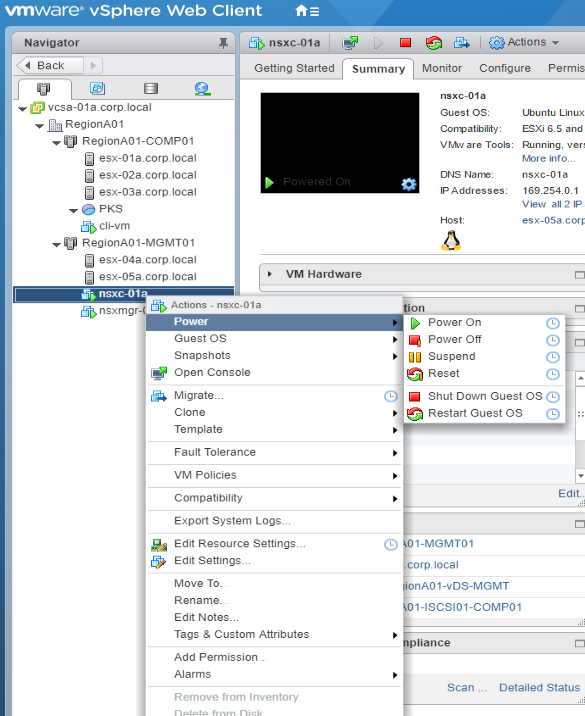

 

2.14 Expand the `Memory` section and set the `Reservation` to `0`

NOTE: This step is provided to help limit the requirements for resource constrained lab environments, if your lab environment has ample hardware resources, you may skip this step

Screenshot 2.14

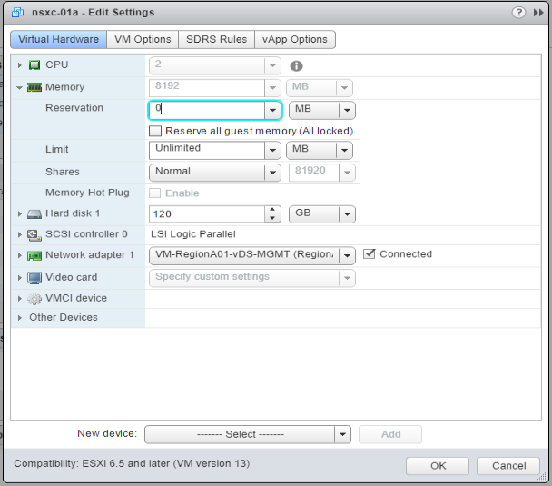

 

2.15 In the vSphere web client, power on the nsxc-01a VM and wait a few minutes for the controller to fully boot up before proceeding

Screenshot 2.15

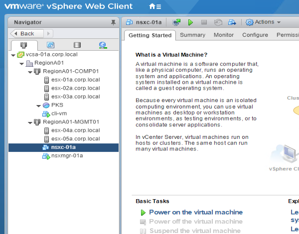

 

2.16 SSH to the controller VM and login to verify deployment

Screenshot 2.16

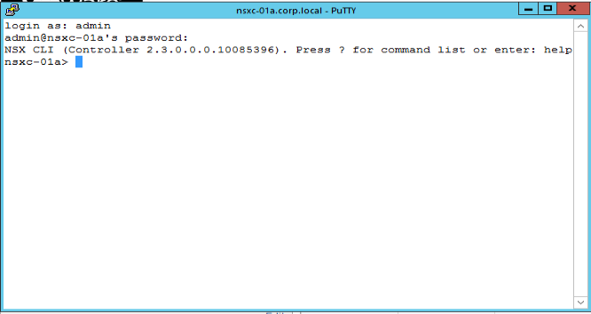

 

#### Step 3: Create NSX Cluster (Management Plane & Cluster Control Plane)

3.1 Open and SSH or console session with NSX Manager and gather the API thumbrint with the command `get certificate api thumbprint`

Screenshot 3.1

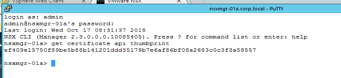

 

3.2 Open and SSH or console session with the NSX Controller(s) and enter the following command using the NSX Manager thumbprint from your environment to join the controller to the managment cluster:

`join-management-plane 192.168.110.42 thumbprint ef409e15750f89be5b88b141201ddd35179b7e6af86bf08a2683c0c3f3a58557 username admin password VMware1!`

Screenshot 3.2

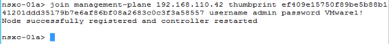

 

3.3 From the NSX Controller CLI enter the following command to configure the control cluster shared secret:

`set control-cluster security-model shared-secret secret VMware1!`

Screenshot 3.3

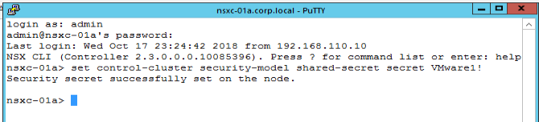

 

3.4 From the NSX Controller CLI intialize the control cluster with the command `initialize control-cluster`

Screenshot 3.4

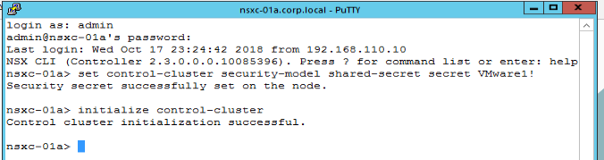

 

3.5 From the NSX Controller CLI activate the control cluster with the command `activate control-cluster`

Screenshot 3.5

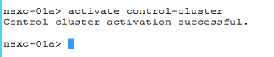

 

3.6 From the NSX Controller CLI confirm connectivity to the NSX Manager with the command `get managers`

Screenshot 3.6

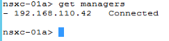

 

3.7 From the NSX Controller CLI check control cluster details and status with the command `get control-cluster status`

Screenshot 3.7

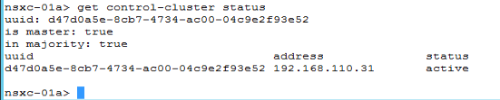

 

3.8 Resume your SSH session with NSX Manager and check the management cluster status with the command `get management-cluster status`

Screenshot 3.8

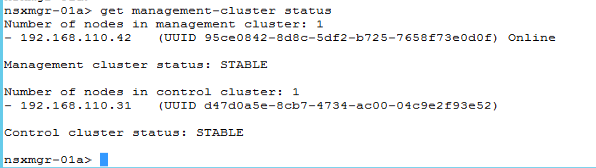

 

3.9 Open a browser session, log in to the NSX Manager UI and select System > Components to monitor the management and control cluster status

Screenshot 3.9

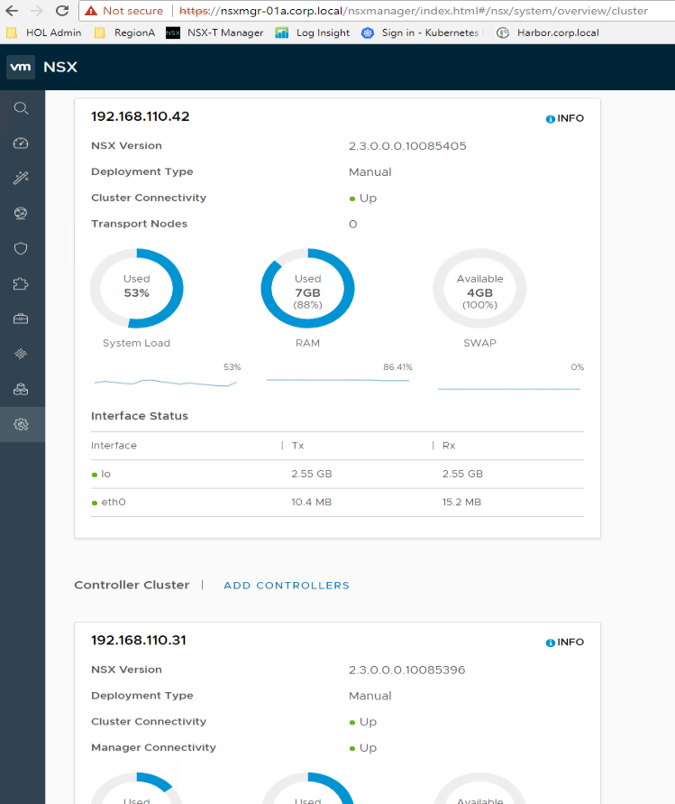

 

#### Step 4: Deploy NSX Edges

4.1 In the vSphere web client (not the HTML5 Client), From the Hosts and Clusters view, right click on the RegionA01-MGMT01 Cluster and select `Deploy OVF Template'

Screenshot 4.1

 

4.2 On the `Select Template` step, select `Local File` and navigate to the NSX Edgt OVA

Screenshot 4.2

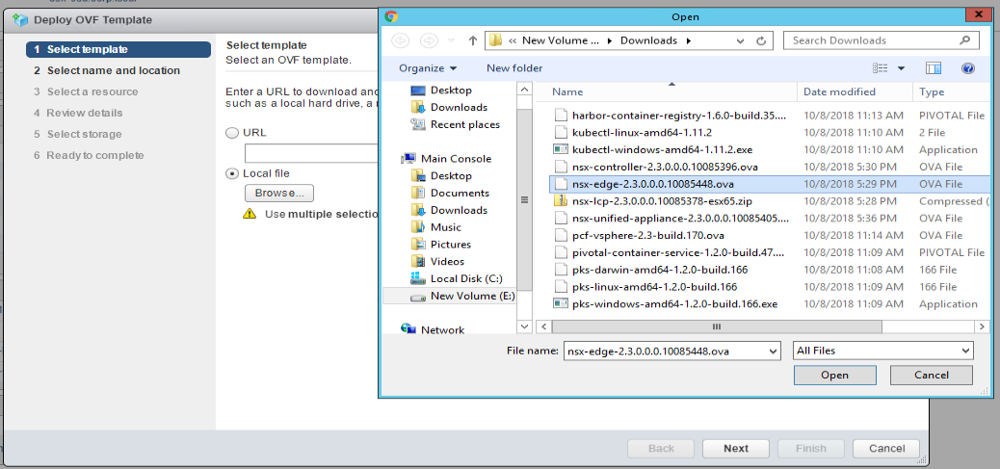

 

4.3 On the `Select name and location` step, set the `Name` to `nsxedge-01a` and select the `RegionA01` datacenter

Screenshot 4.3

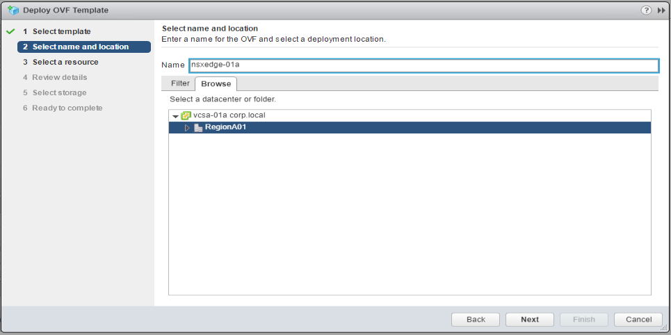

 

4.4 On the `Select a resource` step, select the `RegionA01-MGMT01` cluster

Screenshot 4.4

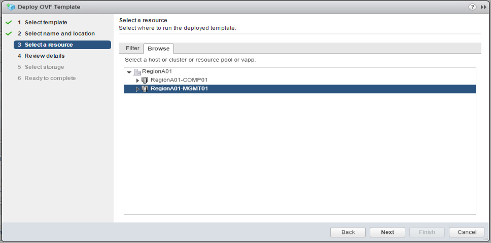

 

4.5 On the `Review details` Step, verify details and click `Next`

Screenshot 4.5

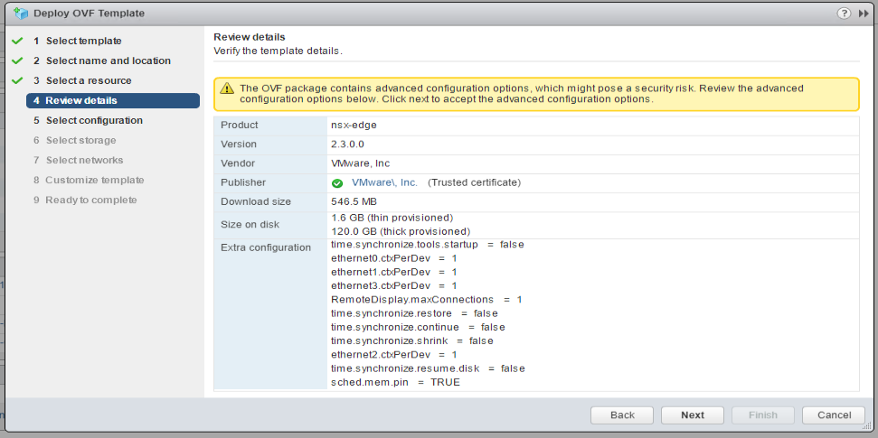

 

4.6 On the `Select Configuration` step, select the `Small` configuration

Screenshot 4.6

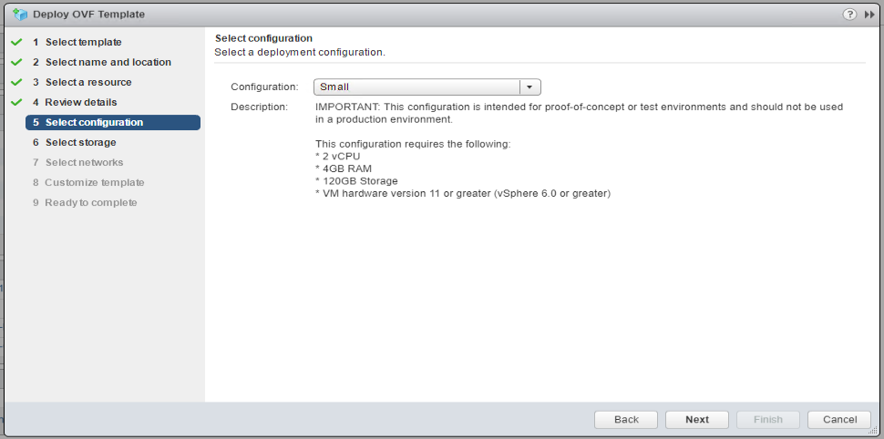

 

4.7 On the `Select Storage` step, select `Thin Provision` as the virtual disk format and `RegionA01-ISCSI01-COMP01` as the datastore

Screenshot 4.7

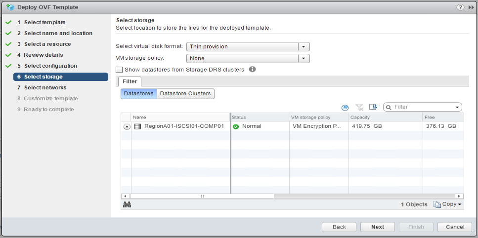

 

4.8 On the `Select Networks` step, set each `Destination Network` to `VM-RegionA01-vDS-MGMT`

Screenshot 4.8

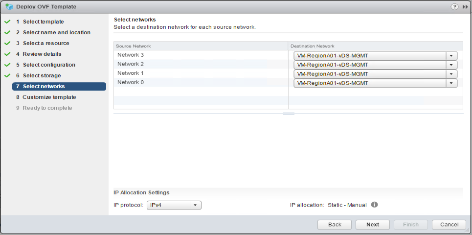

4.9 On the `Customize template` step, set enter the following details:

- CLI admin user password: VMware1!
- CLI audit user password: VMware1!
- Manager IP: 192.168.110.42
- Manager Thumbprint: Use the thumbprint from step 3.1 above
- System Root User Password: VMware1!
- DNS Server List: 192.168.110.10
- Domain Search List: corp.local
- Default IPv4 Gateway: 192.168.110.1
- Hostname: nsxedge-01a
- Management Network IPv4 Address: 192.168.110.91
- Management Network Netmask: 255.255.255.0
- Allow root SSH Logins: True
- Enable SSH: True
- NTP Server List: 192.168.100.1

Screenshot 4.9

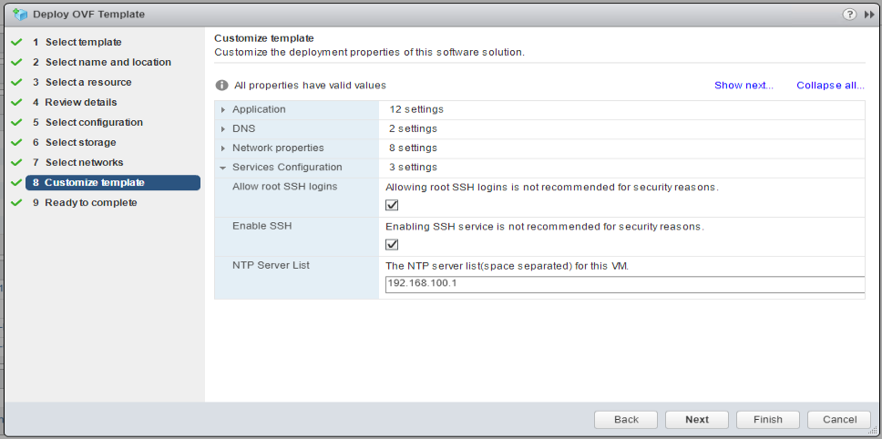

 

4.10 On the `Ready to complete` step, verify details and click `Finish`

Screenshot 4.10

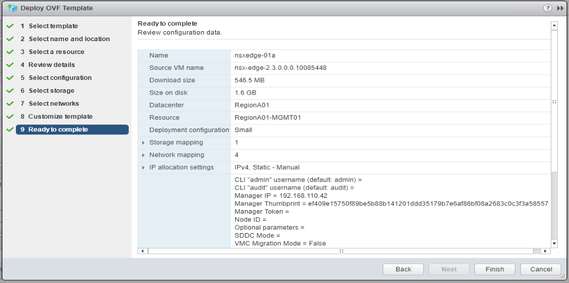

4.11 In the vSphere web client go to the task console and verify that the Status for Deploy OVF Template is "Completed" before proceeding
 

Screenshot 4.11

 

4.12 In the vSphere web client go to Hosts and Clusters and on the `Actions` menu for `nsxedge-01a`, select `Edit Settings`

Screenshot 4.12

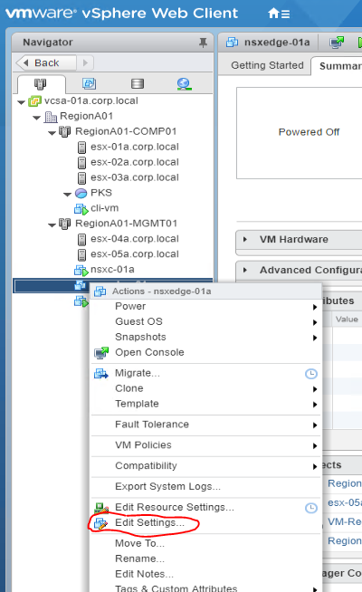

 

4.13 Expand the `Memory` section and set the `Reservation` to `0`

NOTE: This step is provided to help limit the requirements for resource constrained lab environments, if your lab environment has ample hardware resources, you may skip this step

Screenshot 4.13

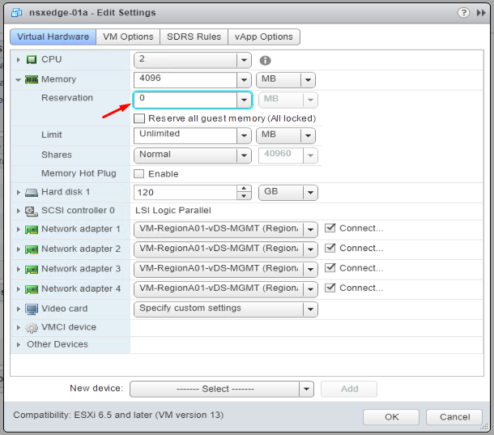

 

4.14 In the vSphere web client power on the NSX Edge VM, wait a few minutes for it to fully boot up before proceeding to the next step

Screenshot 4.14

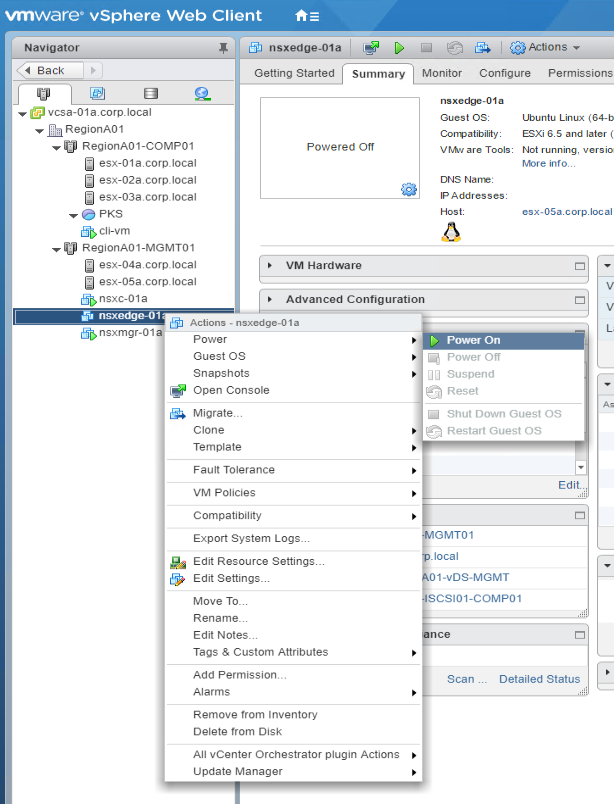

 

4.15 Ping the Edge VM

Screenshot 4.15

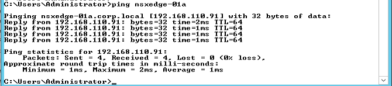

 

4.16 SSH to the Edge VM and login to validate deployment

Screenshot 4.16

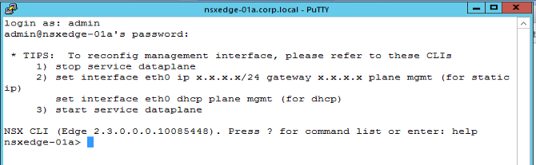

 

#### Step 5: Register Edge with NSX Manager

5.1 Resume your SSH session to NSX Edge and register the NSX Edge with NSX Manager using the following command, substituting the thumbprint with the thumbprint you gathered in step 3.1 above: 

`join management-plane 192.168.110.42 username admin password VMware1! thumbprint ef409e15750f89be5b88b141201ddd35179b7e6af86bf08a2683c0c3f3a58557`

Screenshot 5.1

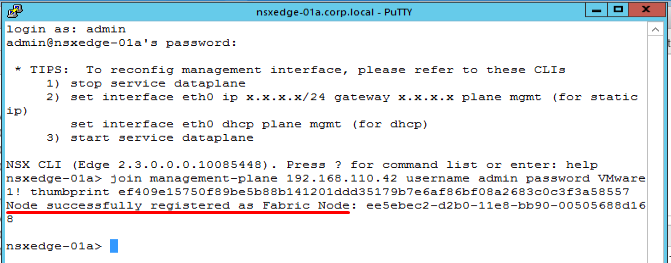

 

5.2 From the NSX Edge CLI, check connectivity to NSX Manager with the command `get managers`

Screenshot 5.2

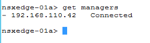

 

5.3 From the NSX Manager UI, go to Fabric > Nodes > Edges and review the available information

Screenshot 5.3

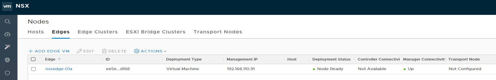

 

#### Step 6: Enable Repository Service on NSX Manager

6.1 To trigger VIB install when hosts are added to the NSX-T fabric, from the NSX Manager CLI, enable the repository service with the command `set service install-upgrade enable`

Screenshot 5.4

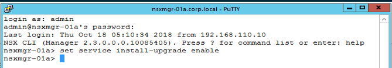

 

#### Step 7: Create TEP IP Pool

6.2

Screenshot

 

Screenshot

 

Screenshot

 

Screenshot

 

Screenshot

